# Claude Code 架构整理

本文基于现有材料对 Claude Code 的整体架构进行重新整理，重点统一章节层级、代码示例、图片说明与术语表达，便于后续查阅与继续补充。

## 目录

- [1. 项目总览与技术栈](#1-项目总览与技术栈)
- [2. 整体架构设计](#2-整体架构设计)
- [3. 启动与初始化流程](#3-启动与初始化流程)
- [4. 核心查询引擎（QueryEngine）](#4-核心查询引擎queryengine)
- [5. 工具系统深度解析](#5-工具系统深度解析)
- [6. 多智能体与 AgentTool](#6-多智能体与-agenttool)
- [7. 权限系统架构](#7-权限系统架构)
- [8. Bridge 远程通信机制](#8-bridge-远程通信机制)
- [9. MCP（Model Context Protocol）集成](#9-mcpmodel-context-protocol集成)
- [10. Hooks 生命周期系统](#10-hooks-生命周期系统)
- [11. 状态管理（AppState）](#11-状态管理appstate)
- [12. 上下文压缩（Compact）机制](#12-上下文压缩compact机制)
- [13. 插件系统](#13-插件系统)
- [14. UI 渲染层（Ink/React）](#14-ui-渲染层inkreact)
- [15. 安全与沙箱机制](#15-安全与沙箱机制)
- [16. 会话存储与记忆系统](#16-会话存储与记忆系统)
- [17. 流式输出与 API 层](#17-流式输出与-api-层)
- [18. 成本追踪与 Token 管理](#18-成本追踪与-token-管理)
- [19. 技术设计决策分析](#19-技术设计决策分析)
- [20. 任务管理系统（Task System）](#20-任务管理系统task-system)
- [21. 系统提示词工程（System Prompt Engineering）](#21-系统提示词工程system-prompt-engineering)
- [22. 推测执行（Speculative Execution）](#22-推测执行speculative-execution)
- [23. 工具搜索（ToolSearchTool）与延迟工具](#23-工具搜索toolsearchtool与延迟工具)
- [24. 文件读取工具（FileReadTool）深度分析](#24-文件读取工具filereadtool深度分析)
- [25. Web 获取工具（WebFetchTool）](#25-web-获取工具webfetchtool)
- [26. Skills 系统](#26-skills-系统)
- [27. 输出样式系统（Output Styles）](#27-输出样式系统output-styles)
- [28. 认证系统](#28-认证系统)
- [29. 调试与诊断工具](#29-调试与诊断工具)
- [30. 多模型支持架构](#30-多模型支持架构)
- [31. 输入处理管道（Input Processing Pipeline）](#31-输入处理管道input-processing-pipeline)
- [32. 流量控制与速率限制](#32-流量控制与速率限制)
- [33. 遥测与分析](#33-遥测与分析)
- [34. 错误处理与恢复机制](#34-错误处理与恢复机制)
- [35. 协调者模式（Coordinator Mode）](#35-协调者模式coordinator-mode)
- [36. Worktree 隔离](#36-worktree-隔离)
- [37. IDE 集成（VS Code / JetBrains）](#37-ide-集成vs-code-jetbrains)
- [38. 会话记录与回放（Transcript）](#38-会话记录与回放transcript)
- [39. 上下文折叠（Context Collapse）](#39-上下文折叠context-collapse)
- [40. PromptSuggestion（提示建议）](#40-promptsuggestion提示建议)
- [41. 数据流安全分析](#41-数据流安全分析)
- [42. 完整数据类型系统参考](#42-完整数据类型系统参考)
- [43. 工具搜索工具（ToolSearchTool）实现](#43-工具搜索工具toolsearchtool实现)
- [44. 架构演进与技术债](#44-架构演进与技术债)
- [45. 性能工程总结](#45-性能工程总结)
- [46. 系统核心交互序列图大全](#46-系统核心交互序列图大全)
- [47. 配置系统全景](#47-配置系统全景)
- [总结与展望](#总结与展望)
- [附录](#附录)

## 1. 项目总览与技术栈

### 1.1 项目定位

Claude Code 是 Anthropic 出品的智能代码助手，以终端 CLI 工具为主体形态，同时支持远程操作模式（Bridge 模式）、SDK 模式，以及多智能体并发模式（Agent Swarms）。它不是一个简单的 chatbot wrapper，而是一套完整的 AI 驱动型开发工具平台。

### 1.2 技术栈总览

| 层次 | 技术选型 | 说明 |
| --- | --- | --- |
| 运行时 | Bun | 高性能 JS/TS 运行时，提供 `bun:bundle`、`feature()` Dead Code Elimination 等特性 |
| 语言 | TypeScript（strict mode） | 类型安全，广泛使用 Zod v4 做运行时校验 |
| UI 框架 | Ink + React | 终端 UI 使用 React 组件树，通过 Ink 渲染到 stdout |
| AI SDK | `@anthropic-ai/sdk` | 官方 Anthropic SDK，支持流式 SSE、Beta APIs |
| MCP | `@modelcontextprotocol/sdk` | Model Context Protocol 标准 SDK |
| CLI 框架 | `commander-js/extra-typings` | 类型安全的 CLI 参数解析 |
| 构建系统 | Bun bundler | `feature('FLAG')` 语法实现编译期 Dead Code Elimination |
| 状态管理 | 自研 `store.ts`（类 Zustand 模式） | 无外部状态库依赖 |
| Schema 校验 | Zod v4 | 所有工具输入、配置、Hooks 输出均有 Zod schema |
| 分析 / 实验 | GrowthBook | 功能开关和 A/B 实验 |

### 1.3 代码组织原则

```text
src/
├── main.tsx          # 程序入口：CLI 解析、启动路由
├── QueryEngine.ts    # 查询引擎：一次完整的 AI 对话协调者
├── query.ts          # 核心查询循环：流式 API 调用 + 工具执行
├── Tool.ts           # 工具类型系统（interface + context）
├── tools.ts          # 工具注册与组装
├── commands.ts       # Slash 命令注册
├── tools/            # 每个工具一个目录（含 BashTool/AgentTool/FileReadTool 等）
├── services/         # 服务层（MCP、compact、API、analytics 等）
├── state/            # AppState + Store
├── bridge/           # Bridge 远程会话通信
├── utils/            # 工具函数（按领域分目录）
├── hooks/            # React Hook（UI 层）
├── components/       # React 组件
├── screens/          # 顶层屏幕（REPL、Setup 等）
└── types/            # 纯类型定义（解决循环依赖）
```

关键设计原则：

- 类型定义与实现分离：`src/types/` 存放纯类型，避免循环依赖。
- 使用 `feature('FLAG')` 做编译期功能裁剪，外部版本可显著缩减包体积。
- 通过懒加载模块（如 `/* eslint-disable @typescript-eslint/no-require-imports */`）规避运行时循环依赖。

## 2. 整体架构设计

### 2.1 宏观架构视图

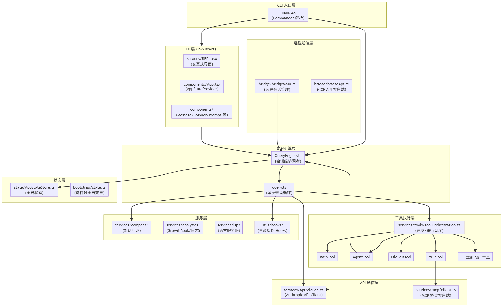

图示用于展示 Claude Code 的宏观架构分层。

### 2.2 核心模块分层

从当前文档内容可以归纳出几个核心层次：

- **入口与初始化层**：负责 CLI 启动、环境注入、鉴权与基础设施装配。
- **查询协调层**：由 `QueryEngine.ts` 和 `query.ts` 组成，负责一次完整对话的调度。
- **工具执行层**：围绕 `Tool.ts`、`tools.ts` 与各类内置工具实现。
- **服务支撑层**：包括 API、MCP、Compact、Bridge、Analytics 等服务模块。
- **状态与 UI 层**：使用自研状态库管理 `AppState`，以 React + Ink 渲染终端界面。

### 2.3 关键数据流

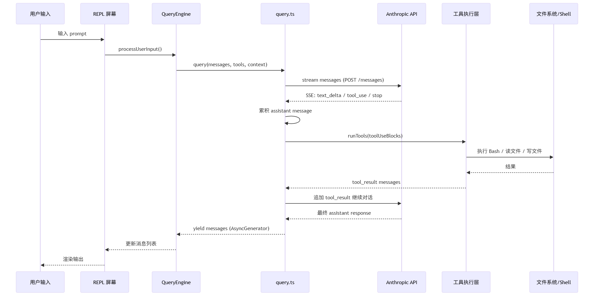

该图展示了用户输入、模型响应、工具调用与 UI 渲染之间的数据流向。

### 2.4 设计原则与约束

- 尽量以流式方式传递消息与工具结果，减少整轮等待。
- 工具输入与配置统一使用 schema 校验，保证模型调用稳定性。
- 通过权限系统、Hook 与沙箱能力，为执行工具提供额外安全边界。

### 2.5 外部图示视角：运行时主链路与章节映射

本地文件 `Claude Code — Agent Runtime 架构.html`把 Claude Code 画成一条较清晰的运行时主链路。这里仅整理**页面上可直接看到的标签与说明**，作为总览层面的补充视角。

页面标题与版本标注为：`Claude Code — Agent Runtime 架构 · v2.1.88 Sourcemap 还原`。

页面顶部将单次 `Query Loop` 分成五段：

1. `System Prompt 组装`（缓存边界 · 动态上下文）
2. `上下文治理`（5 层压缩 · 预算控制）
3. `Claude API 流式`（Streaming · 扩展思考）
4. `Tool 调度执行`（并发分组 · 权限 · Hook）
5. `循环控制`（续轮 · 终止 · 恢复）

页面主体中的主要分区如下：

| 页面分区 | 页面上可见的标签 / 模块 |
| --- | --- |
| 入口层 | `Interactive REPL`、`Headless / SDK`、`Remote / CCR`、`Bridge 工作节点`、`Server Mode` |
| Query Loop · 对话核心 | `QueryEngine.ts`、`query.ts 主循环`、`System Prompt 组装`、`services/api/claude.ts`、`循环控制` |
| Tool Runtime · 40+ 工具 | `tools.ts 注册中心`、`toolOrchestration.ts`、`toolExecution.ts`、`Tool.ts 统一协议`、`StreamingToolExecutor` |
| 外部连接面 | `Anthropic Claude API`、`MCP Server 进程`、`本地文件系统`、`Shell / 子进程` |
| 权限区域 | `PermissionMode`、`4路 Race 解析`、`Bash Classifier`、`规则引擎`、`ResolveOnce 原子竞争` |
| 压缩区域 | `① snip compact`、`② microcompact`、`③ context collapse`、`④ autoCompact`、`⑤ reactive` |
| 扩展区域 | `Commands 80+`、`Skills 技能`、`Plugins 插件`、`MCP Client` |
| Agent / Task | `AgentTool`、`Task 统一壳`、`SendMessageTool`、`worktree / remote 隔离` |
| Feature-Flagged | `BUDDY 虚拟宠物`、`KAIROS 常驻智能体`、`ULTRAPLAN 远程规划`、`Coordinator 协调器` |
| 持久化与状态层 | `bootstrap/state.ts`、`AppStateStore`、`sessionStorage.ts`、`history.ts`、`compact boundary`、`fileHistory`、`memdir/`、`analytics / OTel` |

如果把这张外部图与本文目录进行对应，可以建立如下阅读映射：

| 外部图中的区域 | 图中关键词 | 本文中可优先对照的章节 |
| --- | --- | --- |
| 入口层 | Interactive REPL / Headless / Remote / Bridge / Server Mode | `3. 启动与初始化流程`、`14. UI 渲染层`、`8. Bridge 远程通信机制` |
| Query Loop | `QueryEngine.ts`、`query.ts`、System Prompt、循环控制 | `4. 核心查询引擎`、`17. 流式输出与 API 层` |
| Tool Runtime | `tools.ts`、`toolOrchestration.ts`、`toolExecution.ts`、`Tool.ts` | `5. 工具系统深度解析` |
| 外部依赖 | Claude API、MCP Server、Local FS、Shell | `9. MCP 集成`、`15. 安全与沙箱机制`、`17. 流式输出与 API 层` |
| 权限子系统 | PermissionMode、4 路 Race、规则引擎 | `7. 权限系统架构`、`10. Hooks 生命周期系统` |
| 压缩子系统 | snip compact、microcompact、autoCompact、reactive | `12. 上下文压缩机制` |
| 扩展子系统 | Commands、Skills、Plugins、MCP Client | `13. 插件系统`、`9. MCP 集成` |
| Agent / Task | AgentTool、Task、SendMessageTool、worktree / remote | `6. 多智能体与 AgentTool`、`8. Bridge 远程通信机制` |
| 持久化与状态层 | AppStateStore、sessionStorage、history、fileHistory、memdir | `11. 状态管理`、`16. 会话存储与记忆系统` |

页面右侧还给出了两组补充说明：

- **关键架构判断**：页面以作者标注形式给出 `消息驱动`、`Prompt Cache 优先`、`四层扩展叠加`、`Agent 是一级概念` 四项判断。
- **技术栈**：页面右侧列出 `TypeScript + Bun`、`React / Ink`、`@anthropic-ai/sdk`、`Zod v4`、`@modelcontextprotocol/sdk`，并额外标注 `vendor/: Rust 原生模块 (audio · image · key modifiers · URL handler)`。

页面底部还有两组值得记录的图示元素：

- **安全边界条**：`用户输入 → 4路权限竞争 → Tool 安全边界 → 输入净化 → Hook 拦截 → Feature Gate`。
- **图例**：`请求流`、`循环迭代`、`上下文信号`、`持久化`、`Feature-Flagged`、`实验特性`。

因此，这张图最适合在本文中承担两个作用：

1. 作为前置总览图，帮助快速定位“查询循环、工具执行、权限、压缩、扩展、Agent、状态层”之间的相对位置。
2. 作为阅读导航，把页面标签与本文章节做一一对照，而不是直接替代源码分析。

## 3. 启动与初始化流程

### 3.1 启动序列

`main.tsx` 的启动序列经过性能优化，关键点包括三个“最早侧效”：

```ts
// 1. 性能探针：在所有 import 求值之前打点
profileCheckpoint('main_tsx_entry')

// 2. MDM 配置读取（macOS: plutil，Windows: reg query）并行化
startMdmRawRead()

// 3. macOS Keychain OAuth token 预取（避免 65ms 的串行 spawn）
startKeychainPrefetch()
```

这三个副作用必须在所有其他 import 之前执行，文中给出的原因包括：

- `startMdmRawRead()` 与后续约 135ms 的模块加载并行执行。
- `startKeychainPrefetch()` 将两次顺序 keychain 读取变为并行。

### 3.2 初始化流程图

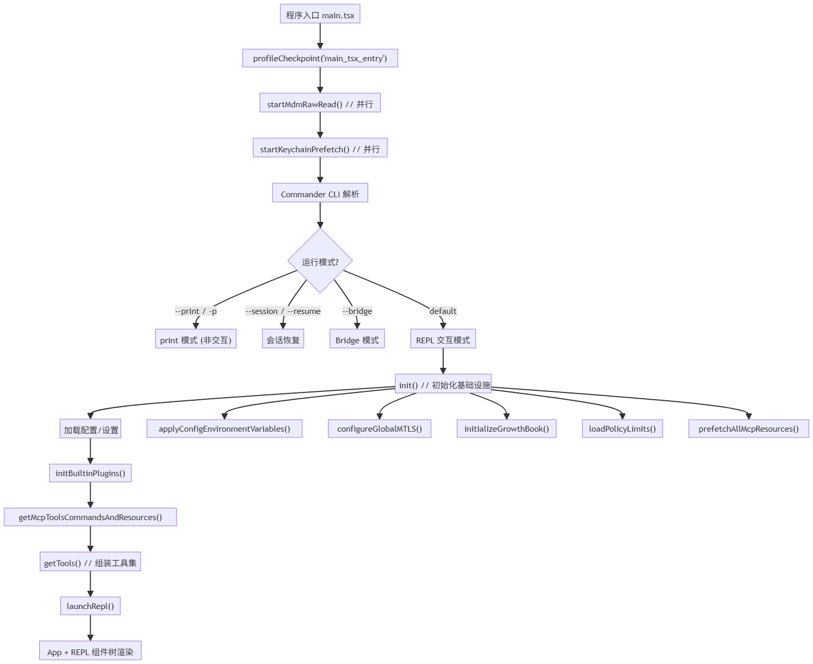

该图用于概览初始化期间的基础设施装配流程。

### 3.3 `init()` 函数关键职责

`src/entrypoints/init.ts` 中的 `init()` 函数是基础设施的组装器，主要职责包括：

1. **环境变量注入**：`applyConfigEnvironmentVariables()` / `applySafeConfigEnvironmentVariables()`，将 MDM / policy 配置映射为环境变量。
2. **TLS 配置**：`configureGlobalMTLS()`，用于企业环境的 mTLS 证书配置。
3. **GrowthBook 初始化**：`initializeGrowthBook()`，影响大量 `feature()` 与 `checkGate` 调用。
4. **策略限制加载**：`loadPolicyLimits()` / `waitForPolicyLimitsToLoad()`，异步加载企业管控策略。
5. **LSP 清理回调**：注册 `shutdownLspServerManager` 相关清理逻辑。
6. **OAuth 预取**：`populateOAuthAccountInfoIfNeeded()`，避免首次请求时的额外延迟。

### 3.4 工具组装：`getTools()` / `assembleToolPool()`

```ts
// src/tools.ts
export function getTools(): Tools {
  // 基础内置工具集
  const base = [
    BashTool, FileReadTool, FileWriteTool, FileEditTool,
    GlobTool, GrepTool, WebFetchTool, WebSearchTool,
    AgentTool, TodoWriteTool,
    // ...other built-in tools
  ]

  // 按 feature flag 条件加入工具
  if (feature('EXPERIMENTAL_REPL')) base.push(REPLTool)
  if (feature('KAIROS')) base.push(...AssistantTools)
  return base
}

// 工具池组装（AgentTool 也会调用，为子 agent 裁剪工具）
export function assembleToolPool(
  parentTools: Tools,
  agentType?: string
): Tools {
  // ...trim tools for sub-agents
  return parentTools
}
```

这一层完成两件事：

- 为主会话装配基础工具集。
- 为子 Agent 或特定运行模式裁剪可见工具集合。

## 4. 核心查询引擎（QueryEngine）

### 4.1 `QueryEngine` 职责

`QueryEngine.ts` 是会话级别的协调者。不同于 `query.ts` 只负责单次 API 调用，它管理整个对话历史、多轮交互、会话存储与跨轮状态。

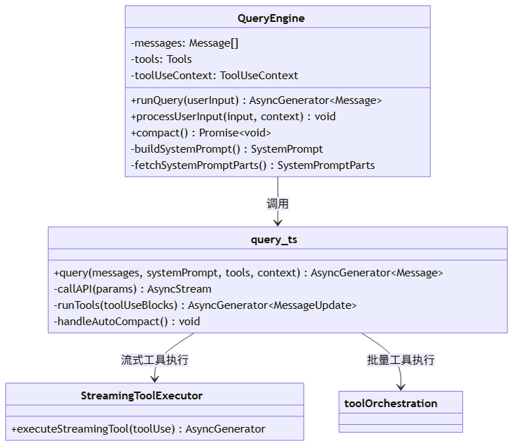

### 4.2 单次查询循环（`query.ts`）

`query.ts` 是系统最核心的函数之一，实现了典型的 ReAct 循环（Reasoning + Acting）。

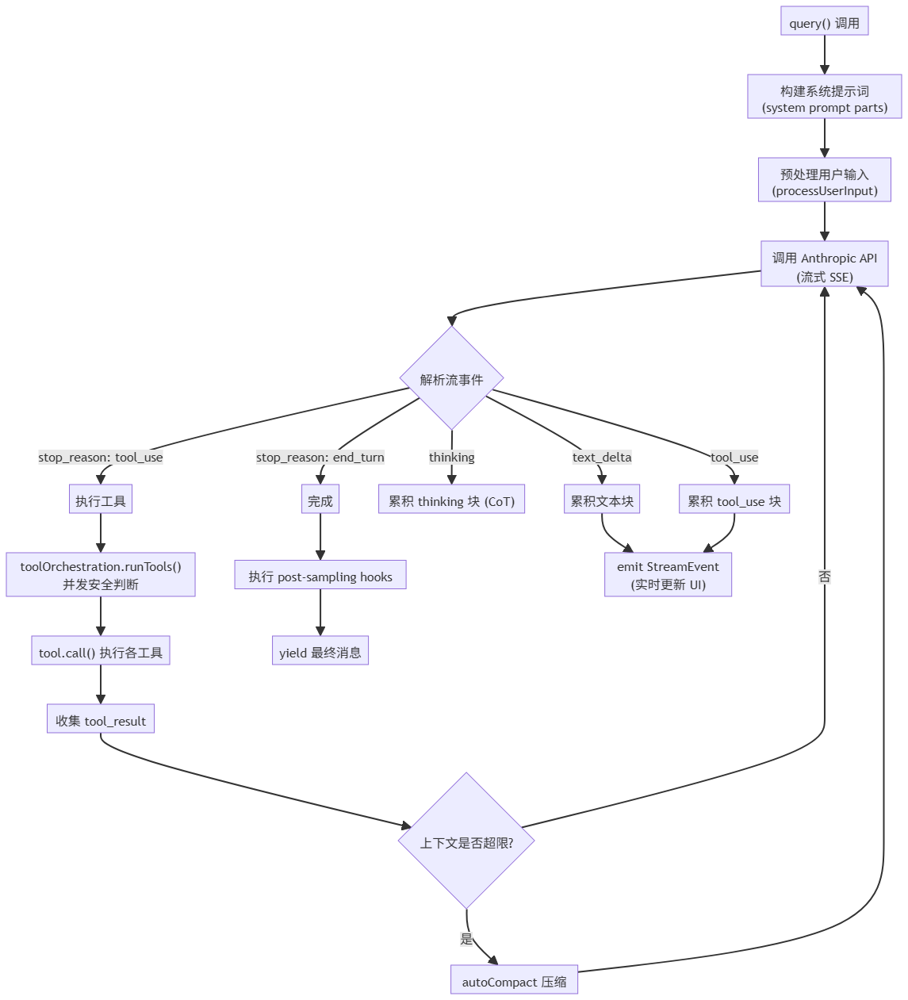

### 4.3 消息规范化（`normalizeMessagesForAPI`）

在发送给 API 之前，消息需要经过规范化处理：

```ts
// src/utils/messages.ts
export function normalizeMessagesForAPI(
  messages: Message[]
): MessageParam[] {
  // 1. 过滤 synthetic messages（系统内部消息）
  // 2. 合并相邻的同角色消息（API 限制：user/assistant 必须交替）
  // 3. 处理 tool_use/tool_result 配对
  // 4. 应用 content replacement（大文件外联存储）
  // 5. 去除重复的 memory attachments
  return normalized
}
```

关键挑战在于：API 要求消息严格交替（`user → assistant → user → ...`），但工具执行会生成中间消息，因此需要额外合并与重排。

### 4.4 流事件处理

`query.ts` 使用 `AsyncGenerator` 模式，向上层实时 `yield` 消息：

```ts
export async function* query(
  messages: Message[],
  systemPrompt: SystemPrompt,
  tools: Tools,
  context: ToolUseContext,
): AsyncGenerator<Message, void> {
  // ...
  for await (const event of stream) {
    switch (event.type) {
      case 'content_block_delta':
        yield accumulate(event.delta)  // 实时 yield 给 UI
        break
      case 'message_stop':
        if (stopReason === 'tool_use') {
          yield* runTools(/* ... */)  // tool results 也 yield 出去
        }
        break
    }
  }
}
```

## 5. 工具系统深度解析

### 5.1 工具类型系统

`Tool.ts` 是工具系统的类型基础，定义了所有工具必须实现的接口：

```ts
// Tool 的核心类型结构（精简版）
export type ToolDef<Input extends AnyObject> = {
  name: string
  description: string
  inputSchema: z.ZodType<Input>

  // 权限检查（在执行前调用）
  isReadonly?: boolean
  checkPermissions?: (input: Input, context: ToolPermissionContext) => PermissionResult

  // 执行逻辑
  call(input: Input, context: ToolUseContext): AsyncGenerator<ToolCallProgress, ToolResult>

  // UI 渲染
  renderToolUseMessage?: (input: Input) => React.ReactNode
  renderToolResultMessage?: (result: ToolResult) => React.ReactNode
}
```

### 5.2 `buildTool()` 工厂函数

所有工具均通过 `buildTool()` 工厂函数创建：

```ts
// Tool.ts
export function buildTool<Input extends AnyObject>(
  def: ToolDef<Input>
): Tool {
  return {
    ...def,
    // 注入标准化的元数据
    userFacingName: def.userFacingName ?? def.name,
    // 包装 call 以添加生命周期追踪
    call: wrapWithTracking(def.call),
  }
}
```

### 5.3 工具执行并发模型

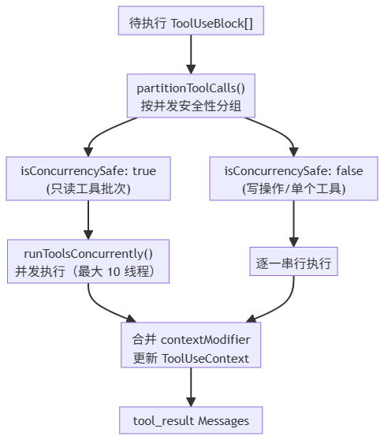

并发安全判断逻辑（来自 `toolOrchestration.ts`）如下：

- 工具的 `isReadonly` 为 `true` 时可并发执行。
- 多个只读工具可组成一个并发批次。
- 遇到任何写操作时，切换到新的串行批次。
- 最大并发数由 `CLAUDE_CODE_MAX_TOOL_USE_CONCURRENCY` 控制，默认值为 `10`。

### 5.4 BashTool 深度解析

`BashTool` 是最复杂的工具之一，涉及 shell 执行、权限检查、沙箱与安全审计等多个维度。

#### 5.4.1 执行流水线

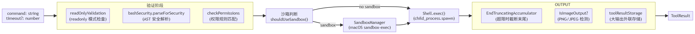

#### 5.4.2 权限规则匹配

```ts
// src/tools/BashTool/bashPermissions.ts
export function bashToolHasPermission(
  command: string,
  rules: PermissionRules,
  context: ToolPermissionContext,
): PermissionResult {
  // 1. 精确匹配 alwaysDeny 规则
  for (const rule of rules.alwaysDeny) {
    if (matchWildcardPattern(command, rule.pattern)) {
      return { type: 'deny', reason: rule.message }
    }
  }

  // 2. 精确匹配 alwaysAllow 规则
  for (const rule of rules.alwaysAllow) {
    if (matchWildcardPattern(command, rule.pattern)) {
      return { type: 'allow' }
    }
  }

  // 3. 前缀提取 + 用户已批准命令检查
  const prefix = permissionRuleExtractPrefix(command)
  if (context.approvedCommands.has(prefix)) {
    return { type: 'allow' }
  }

  // 4. 需要用户确认
  return { type: 'ask', suggestion: prefix }
}
```

#### 5.4.3 命令语义分类

`BashTool` 实现了一套命令语义分类系统，用于 UI 展示时的折叠优化：

```ts
// 搜索命令（grep/find/rg 等）→ "Searched N files"
const BASH_SEARCH_COMMANDS = new Set(['find', 'grep', 'rg', 'ag', 'ack'])

// 读取命令（cat/head/tail 等）→ "Read N files"
const BASH_READ_COMMANDS = new Set(['cat', 'head', 'tail', 'less'])

// 目录列举（ls/tree/du）→ "Listed N directories"
const BASH_LIST_COMMANDS = new Set(['ls', 'tree', 'du'])

// 语义中立（不影响分类判断，如 echo/printf）
const BASH_SEMANTIC_NEUTRAL_COMMANDS = new Set(['echo', 'printf', 'true'])
```

补充说明：对于 `cat file | grep pattern` 这样的管道命令，只有所有组成部分都属于搜索 / 读取语义时，整体才会被标记为可折叠命令。

### 5.5 `FileEditTool`

`FileEditTool` 使用基于字符串的精确替换：

```ts
// 核心操作：old_string → new_string 精确替换
// 要求：old_string 在文件中必须唯一出现（防止意外修改）
type FileEditInput = {
  file_path: string
  old_string: string   // 必须包含 3-5 行上下文
  new_string: string
}
```

关键安全设计包括：

1. 读取文件后检查 `old_string` 出现次数；若不唯一则拒绝。
2. 写入前计算文件指纹（hash），支持后续 diff 生成。
3. 触发 `fileHistoryTrackEdit()` 记录文件历史。

### 5.6 工具结果大文件处理

当工具输出超过阈值时，系统会使用外联存储机制：

```ts
// src/utils/toolResultStorage.ts
export async function buildLargeToolResultMessage(
  result: string,
  toolUseId: string,
): Promise<ToolResultBlockParam> {
  const path = getToolResultPath(toolUseId)
  await ensureToolResultsDir()
  await writeFileSync(path, result)

  // 返回一个“引用消息”，实际内容在磁盘
  return {
    type: 'tool_result',
    content: `[Output saved to ${path}. Use FileRead to read it]`
  }
}
```

## 6. 多智能体与 AgentTool

### 6.1 `AgentTool` 整体架构

`AgentTool` 是 Claude Code 多智能体能力的核心，支持：

- 后台异步执行（`run_in_background: true`）
- Worktree 隔离（`isolation: 'worktree'`）
- 远程执行（`isolation: 'remote'`，通过 CCR 基础设施）
- 团队模式（`swarms`，多 Agent 并行协作）

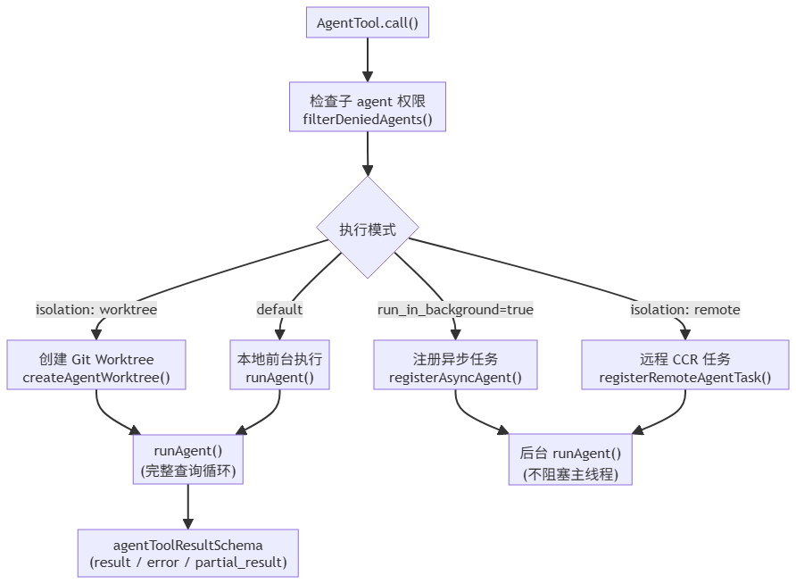

### 6.2 子 Agent 上下文继承

子 Agent 通过 `ToolUseContext` 继承父上下文，但在工具可见性、执行边界与隔离模式上存在关键差异。
```ts
// src/utils/agentContext.ts
export function createSubagentContext(
  parentCtx: ToolUseContext,
  agentId: AgentId,
  opts: SubagentOpts,
): ToolUseContext {
  return {
    ...parentCtx,
    // 快照当前状态（不继承父的 setAppState，防止子 agent 污染主展示）
    getAppState: () => frozenSnapshot,
    setAppState: noopForAsync,  // async agent 不能修改父状态
    // 子 agent 共享基础设施（tasks、session hooks）
    setAppStateForTasks: parentCtx.setAppStateForTasks ?? parentCtx.setAppState,
    // 权限从父继承，但可以降级（plan mode 等）
    options: { ...parentCtx.options, tools: childTools },
  }
}
```
### 6.3 Agent 任务生命周期

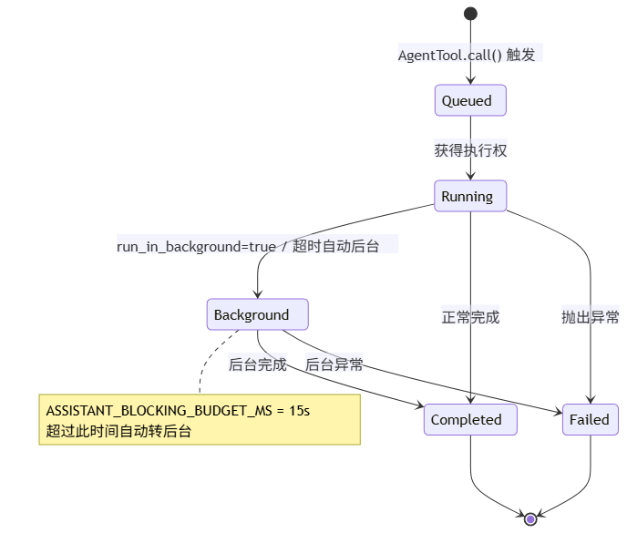

### 6.4 Fork 子 Agent 模式

当 `isForkSubagentEnabled()` 时，子 Agent 可以 fork 出一个与父 Agent 完全相同上下文的副本。
```ts
// src/tools/AgentTool/forkSubagent.ts
export async function buildForkedMessages(
  parentMessages: Message[],
  forkPoint: MessageId,
): Promise<Message[]> {
  // 从 fork 点截断父历史
  // 注入 worktree 变更通知
  // 子 agent 在独立 worktree 中继续
}
```
### 6.5 多 Agent 协作（Swarms）

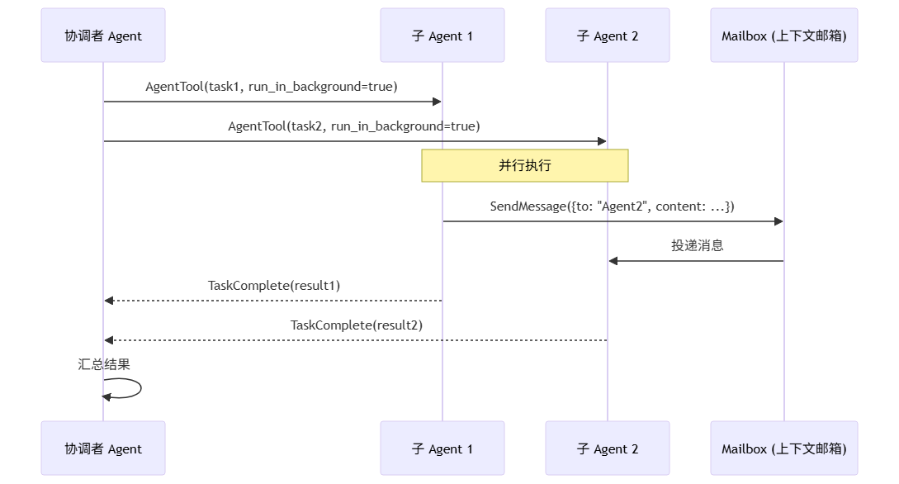
## 7. 权限系统架构

### 7.1 权限模式层级

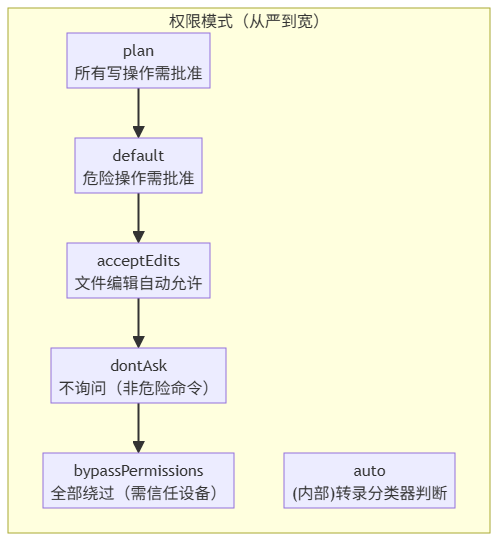

### 7.2 权限决策树

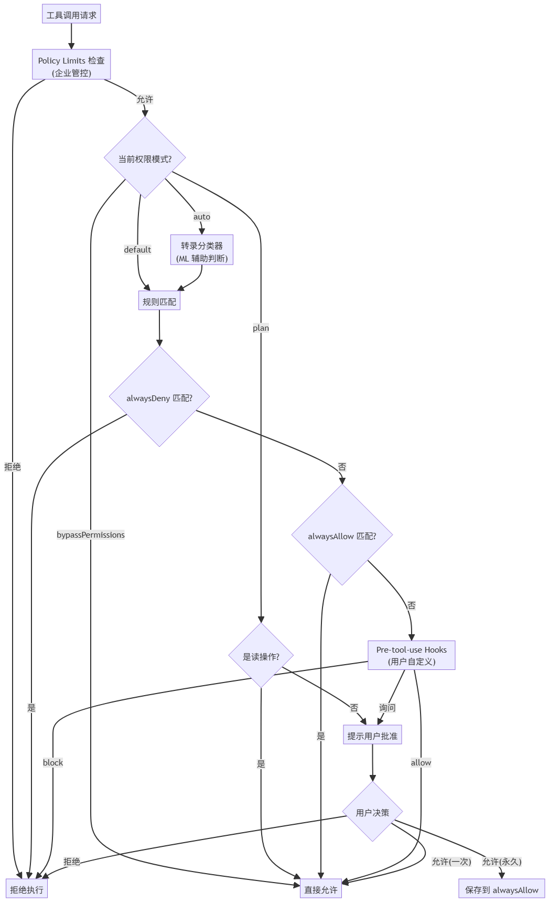

### 7.3 权限规则来源

```ts
// src/types/permissions.ts
export type PermissionRuleSource =
  | 'userSettings'      // ~/.claude/settings.json
  | 'projectSettings'   // .claude/settings.json
  | 'localSettings'     // .claude/settings.local.json
  | 'flagSettings'      // .claude/settings.flag.json (managed)
  | 'policySettings'    // MDM/policy 管控
  | 'cliArg'            // --allowedTools / --disallowedTools CLI 参数
  | 'session'           // 运行时动态添加（"永久允许"）
  | 'tool'              // 工具自身声明
```

| 来源 | 配置位置 / 入口 | 说明 |
| --- | --- | --- |
| `policySettings` | MDM / policy 管控 | 文中给出的最高优先级来源 |
| `cliArg` | `--allowedTools` / `--disallowedTools` | 通过 CLI 参数施加限制 |
| `projectSettings` | `.claude/settings.json` | 项目级配置 |
| `userSettings` | `~/.claude/settings.json` | 用户级全局配置 |
| `localSettings` | `.claude/settings.local.json` | 本地项目配置 |
| `flagSettings` | `.claude/settings.flag.json` | 托管设置 |
| `session` | 运行时动态添加 | 如“永久允许” |
| `tool` | 工具自身声明 | 由工具本身给出默认限制 |

规则优先级为：`policySettings > cliArg > projectSettings > userSettings > session`。

### 7.4 Denial Tracking（拒绝追踪）

系统维护一个 `DenialTrackingState`，用于记录在当前会话中被拒绝的操作，以便：

- 防止 AI 无限重试已被拒绝的操作。
- 生成“为什么这个操作被拒绝了”的摘要。
- 为 Auto 模式提供行为学习线索。

## 8. Bridge 远程通信机制

### 8.1 Bridge 架构概述

Bridge 是 Claude Code 的企业级云端计算资源（CCR）接入层，允许在本地 Claude Code 客户端与远程计算资源之间建立双向通信。

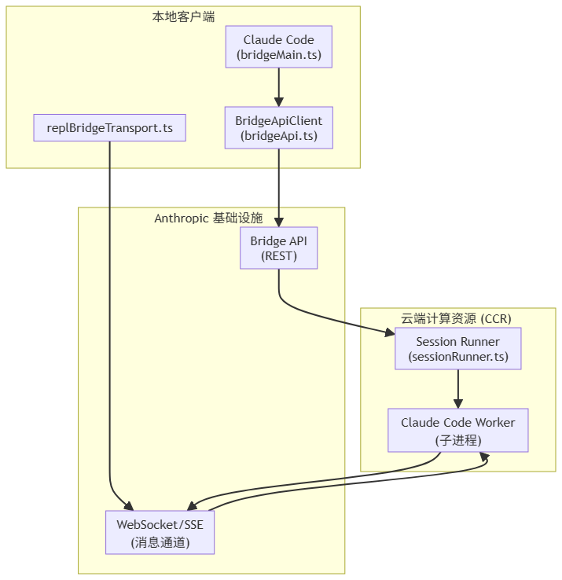

### 8.2 Bridge 生命周期状态机

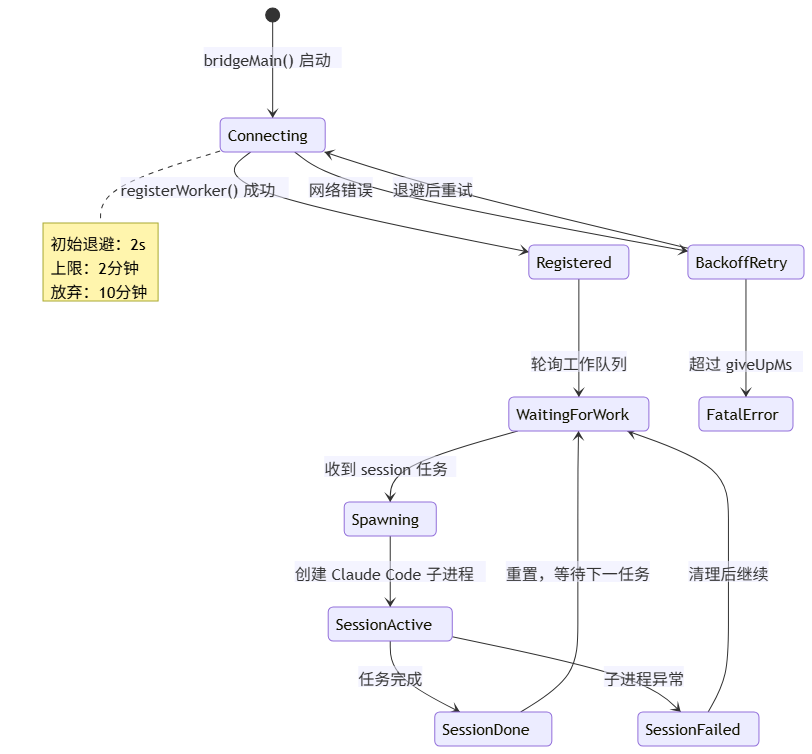

### 8.3 JWT 令牌管理

```ts
// src/bridge/jwtUtils.ts
export function createTokenRefreshScheduler(
  getBridgeConfig: () => BridgeConfig,
  refreshToken: () => Promise<string>,
): TokenRefreshScheduler {
  // JWT 令牌在到期前提前刷新（避免 session 中途过期）
  // 使用指数退避处理刷新失败
  // 令牌变更时通知所有活跃 session
}
```

### 8.4 多 Session 模式

```ts
type SpawnMode =
  | 'single'        // 单 session（默认）
  | 'spawn'         // 预先 spawn N 个 worker，接受任意任务
  | 'capacity'      // 动态扩缩容
  | 'create-in-dir' // 在指定目录创建 session
```

| 模式 | 含义 | 备注 |
| --- | --- | --- |
| `single` | 单 session 默认模式 | 默认运行方式 |
| `spawn` | 预先启动多个 worker | 接受任意任务 |
| `capacity` | 动态扩缩容 | 面向容量调度 |
| `create-in-dir` | 在指定目录创建 session | 强调目录定位 |

文中还提到：`isMultiSessionSpawnEnabled()` 通过 GrowthBook gate `tengu_ccr_bridge_multi_session` 控制功能开放范围。

### 8.5 Work Secret 机制

```ts
// src/bridge/workSecret.ts
// work_secret 是一个短期令牌，证明 worker 合法性
// CCR worker 启动时获取 work_secret，用于向 bridge API 注册
declare function buildSdkUrl(workSecret: WorkSecret): URL
declare function decodeWorkSecret(encoded: string): WorkSecret
declare function registerWorker(secret: WorkSecret): Promise<Registration>
```

## 9. MCP（Model Context Protocol）集成

### 9.1 MCP 传输层支持

Claude Code 支持三种 MCP 传输协议：

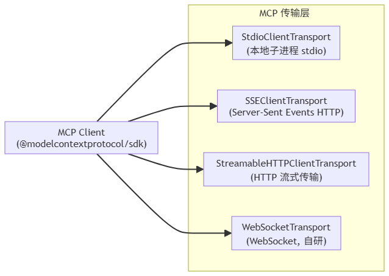

### 9.2 MCP 工具注册流程

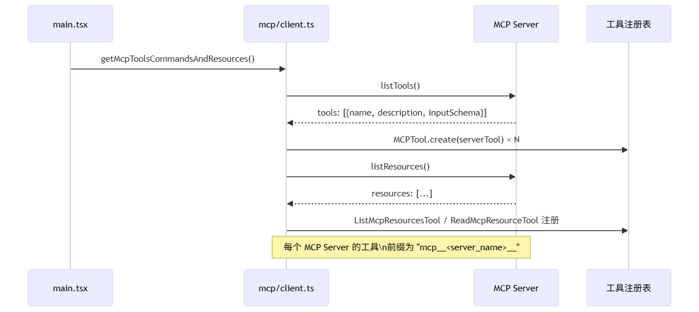

### 9.3 `MCPTool` 执行流

```ts
// src/tools/MCPTool/MCPTool.ts
export async function* call(
  input: z.infer<typeof schema>,
  context: ToolUseContext,
): AsyncGenerator<MCPProgress, ToolResult> {
  // 1. 查找对应的 MCP 服务器连接
  const server = findMcpServer(context.options.mcpClients, serverName)

  // 2. 调用 server.callTool()（MCP SDK）
  const result = await server.callTool({
    name: originalToolName,
    arguments: input,
  })

  // 3. 处理各种内容类型（text/image/resource）
  // 4. 处理大输出（图片压缩、内容截断、二进制外联）
  yield* processContent(result.content)
}
```

### 9.4 资源管理

MCP 资源使用双层访问模型：

- 层 1：`ListMcpResourcesTool`，列出所有资源。
- 层 2：`ReadMcpResourceTool`，读取具体资源内容（URI）。

### 9.5 Elicitation（弹出式 URL 认证）

MCP 服务器可以通过 `-32042` 错误码触发 URL 认证流程：

```ts
// elicitationHandler.ts
// 当 MCP 调用返回 ElicitRequest 时：
// 1. REPL 模式：排入 UI 队列（弹出对话框）
// 2. print/SDK 模式：通过 structuredIO.handleElicitation() 处理
```

## 10. Hooks 生命周期系统

### 10.1 Hook 触发点全景

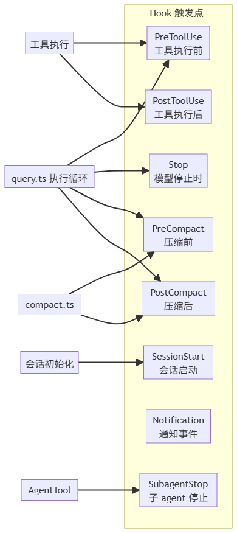

### 10.2 Hook 配置格式

```json
{
  "hooks": {
    "PreToolUse": [
      {
        "matcher": "BashTool",
        "hooks": [
          {
            "type": "command",
            "command": "~/.claude/hooks/pre_bash_check.sh"
          }
        ]
      }
    ],
    "PostToolUse": [
      {
        "matcher": ".*",
        "hooks": [
          {
            "type": "command",
            "command": "echo 'Tool used: $TOOL_NAME' >> /tmp/audit.log"
          }
        ]
      }
    ]
  }
}
```

### 10.3 Hook 执行流（`src/utils/hooks.ts`）

```ts
// hooks.ts 核心执行逻辑（精简）
export async function executeHook(
  hookType: HookType,
  toolName: string,
  input: HookInput,
  context: HookContext,
): Promise<HookJSONOutput | null> {
  // 1. 从配置快照中找到匹配的 hooks
  const matched = getHooksConfigFromSnapshot()
    .filter(h => matchesHook(h, hookType, toolName))

  // 2. 按顺序执行（串行，一个 hook 失败可以中止链）
  for (const hook of matched) {
    const result = await runHookCommand(hook, input)

    if (isSyncHookJSONOutput(result)) {
      if (result.decision === 'block') {
        return result  // 阻止操作
      }
    }
  }
}
```

### 10.4 Hook 环境变量注入

每个 Hook 执行时会注入以下环境变量：

| 变量名 | 含义 |
| --- | --- |
| `CLAUDE_SESSION_ID` | 当前会话 ID |
| `CLAUDE_TOOL_NAME` | 工具名称 |
| `CLAUDE_TOOL_INPUT` | 工具输入（JSON） |
| `CLAUDE_TRANSCRIPT_PATH` | 对话记录路径 |
| `CLAUDE_PROJECT_ROOT` | 项目根目录 |
| `CLAUDE_AGENT_ID` | 子 Agent 场景下的 agent ID |

### 10.5 Hook 输出协议

Hooks 通过 `stdout` 返回 JSON，支持两种输出模式：

```ts
type HookJSONOutput =
  | {
      type: 'sync'
      decision?: 'block' | 'allow'
      reason?: string
      // 可以修改工具输入（仅 PreToolUse）
      modifications?: Partial<ToolInput>
    }
  | {
      type: 'async'
      taskId: string
      // 异步 hook 注册到 AsyncHookRegistry
      // 完成后通过 taskId 回调
    }
```

## 11. 状态管理（AppState）

### 11.1 状态架构

Claude Code 使用自研的类 Zustand 状态库，无外部状态管理依赖。按照文中给出的 `src/state/store.ts` 设计，它至少包含三类核心能力：

- `getState()`：读取当前状态快照。
- `setState(fn)`：以函数式方式基于旧状态生成新状态，并触发状态变更通知。
- `subscribe(listener)`：注册监听器，并返回取消订阅函数。

```ts
// src/state/store.ts
export type Store<T> = {
  getState(): T
  setState(fn: (prev: T) => T): void
  subscribe(listener: () => void): () => void
}

export function createStore<T>(
  initialState: T,
  onChangeAppState?: (args: { newState: T; oldState: T }) => void,
): Store<T> {
  let state = initialState
  const listeners = new Set<() => void>()
  return {
    getState: () => state,
    setState: (fn) => {
      const next = fn(state)
      const prev = state
      state = next
      onChangeAppState?.({ newState: next, oldState: prev })
      listeners.forEach(l => l())
    },
    subscribe: (l) => {
      listeners.add(l)
      return () => listeners.delete(l)
    },
  }
}
```
从文档中的实现片段可以看出，这个 store 还会在状态变更时调用 `onChangeAppState` 回调，并依次通知所有订阅者。

### 11.2 `AppState` 关键字段概览
AppState（AppStateStore.ts）包含以下主要状态域：
```ts
type AppState = DeepImmutable<{
  // UI 状态
  mainLoopModel: ModelSetting        // 当前使用的模型
  verbose: boolean                   // 是否显示详细信息
  expandedView: 'none' | 'tasks' | 'teammates'

  // 权限
  toolPermissionContext: ToolPermissionContext

  // 消息列表（核心）
  messages: Message[]

  // 任务状态（后台 agent）
  tasks: TaskState[]

  // MCP
  mcpConnections: MCPServerConnection[]

  // 推测执行
  speculationState: SpeculationState

  // 待办事项
  todoList: TodoList | null

  // 设置
  settings: SettingsJson

  // Bridge/远程
  remoteSessionUrl: string | undefined
  bridgeStatus: BridgeStatusType | undefined

  // 成本追踪
  // ... 其他字段
}>
```

### 11.3 状态更新模式

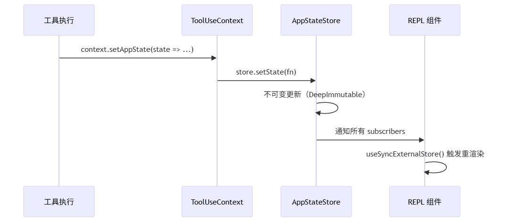

### 11.4 `DeepImmutable` 类型系统

所有状态使用 `DeepImmutable<T>` 包装，确保状态只能通过 `setState` 修改：

```ts
// src/types/utils.ts
export type DeepImmutable<T> = T extends (infer U)[]
  ? ReadonlyArray<DeepImmutable<U>>
  : T extends object
    ? { readonly [K in keyof T]: DeepImmutable<T[K]> }
    : T
```

## 12. 上下文压缩（Compact）机制

### 12.1 触发条件

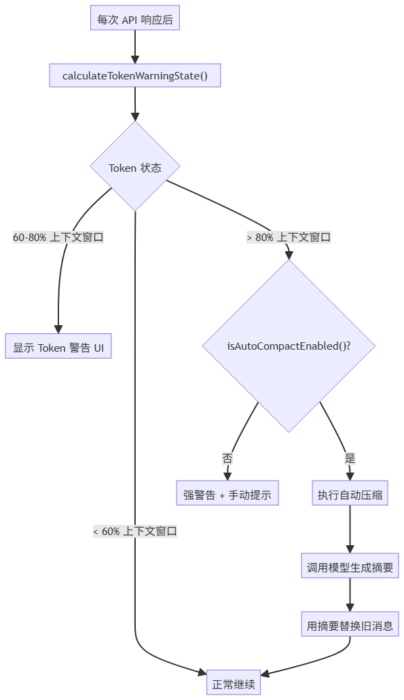

### 12.2 压缩实现细节

```ts
// src/services/compact/compact.ts
export async function compactConversation(
  messages: Message[],
  model: string,
  systemPrompt: SystemPrompt,
  context: ToolUseContext,
): Promise<CompactionResult> {
  // 1. 找到最优压缩边界
  //    - 不在工具调用中间截断
  //    - 保留最近 N 轮对话（避免重要上下文丢失）
  const boundary = findCompactionBoundary(messages)

  // 2. 保留边界后的消息
  const recentMessages = messages.slice(boundary)
  const toCompress = messages.slice(0, boundary)

  // 3. 调用 Claude 生成摘要
  const summary = await generateSummary(toCompress, model, systemPrompt)

  // 4. 构建压缩后的消息列表
  // 摘要作为 system message 前置
  return {
    compactedMessages: [toSummaryMessage(summary), ...recentMessages],
    boundary,
    tokensRemoved: 0,
  }
}
```

### 12.3 上下文窗口计算

```ts
// src/services/compact/autoCompact.ts
export function getEffectiveContextWindowSize(model: string): number {
  // 预留 20,000 tokens 给压缩摘要输出（p99.99 实测值 17,387）
  const MAX_OUTPUT_TOKENS_FOR_SUMMARY = 20_000
  const reserved = Math.min(
    getMaxOutputTokensForModel(model),
    MAX_OUTPUT_TOKENS_FOR_SUMMARY
  )
  const contextWindow = getContextWindowForModel(model, getSdkBetas())
  return contextWindow - reserved
}
```

### 12.4 会话记忆压缩

独立于对话历史压缩，会话记忆（`memdir`）也有独立的压缩路径：

```ts
// src/services/compact/sessionMemoryCompact.ts
// 当会话记忆文件超过阈值时，用摘要压缩旧条目
declare function trySessionMemoryCompaction(
  memPath: string,
  model: string,
): Promise<boolean>
```

## 13. 插件系统

### 13.1 插件类型

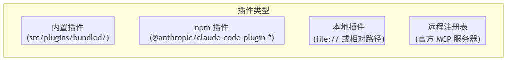

### 13.2 插件功能扩展点

插件可以扩展以下能力：

```ts
type PluginCapabilities = {
  // MCP 服务器（工具扩展）
  mcpServers?: McpServerConfig[]

  // Slash 命令
  commands?: Command[]

  // Hooks 注册
  hooks?: HooksConfig

  // 系统提示词追加
  appendSystemPrompt?: string

  // 权限规则
  permissionRules?: PermissionRules

  // 技能（Skills，RAG 检索文档）
  skills?: SkillConfig[]
}
```

### 13.3 插件加载流程

```ts
// src/utils/plugins/pluginLoader.ts
export async function loadAllPlugins(
  sources: PluginSource[],
): Promise<LoadedPlugin[]> {
  for (const source of sources) {
    // 1. 解析 package.json（npm 插件）或 plugin.json（本地插件）
    // 2. 验证 manifest schema（使用 Zod）
    // 3. 注册 MCP servers、commands、hooks
    // 4. 缓存到磁盘（pluginLoader 支持仅返回缓存）
  }
}
```

## 14. UI 渲染层（Ink/React）

### 14.1 终端 UI 架构

Claude Code 使用 React + Ink 在终端中渲染，实现了一个完整的 TUI（Terminal User Interface）：

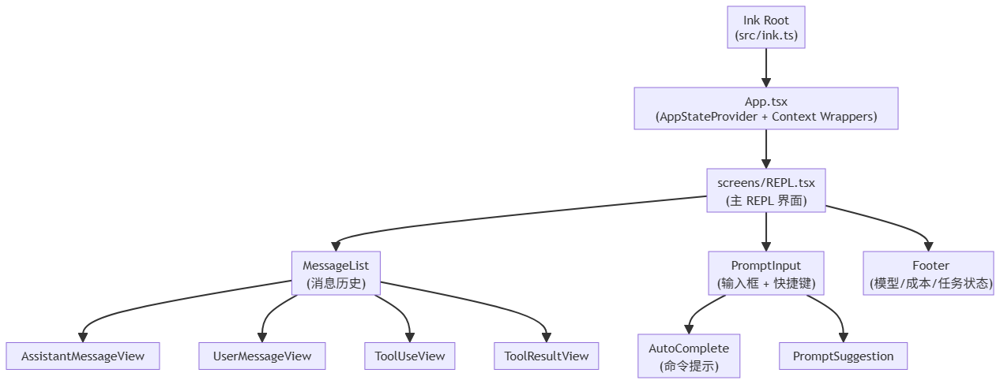

### 14.2 消息渲染系统

每个工具都提供自己的 UI 渲染器（`renderToolUseMessage` / `renderToolResultMessage`）：

```tsx
// BashTool/UI.tsx
export function renderToolUseMessage(input: BashInput): React.ReactNode {
  return (
    <ToolUseMessage
      title="Bash"
      icon={<BashIcon />}
      collapsible={isSearchOrReadBashCommand(input.command)}
    >
      <InlineCode>{input.command}</InlineCode>
    </ToolUseMessage>
  )
}

export function renderToolResultMessage(
  result: BashResult,
): React.ReactNode {
  if (result.isImage) {
    return <ImageResultView src={result.base64} />
  }
  return (
    <CollapsibleContent
      summary={generateBashSummary(result)}
      expanded={<pre>{result.output}</pre>}
    />
  )
}
```

### 14.3 React Compiler 优化

源码中大量使用了 React Compiler（`react/compiler-runtime`）自动缓存：

```ts
// 编译器输出示例（AppState.tsx）
export function AppStateProvider(t0) {
  const $ = _c(13)  // _c = useMemoCacheSize(13)，自动 memoize
  // ...
  if ($[0] !== initialState || $[1] !== onChangeAppState) {
    t1 = () => createStore(/* ... */)
    $[0] = initialState; $[1] = onChangeAppState; $[2] = t1
  } else {
    t1 = $[2]  // 命中缓存，复用
  }
}
```

### 14.4 流式输出优化

为减少 TUI 闪烁，Claude Code 使用了多项流式渲染优化：

- `src/utils/fpsTracker.ts`：监控渲染帧率，动态调节刷新策略。
- 虚拟化：超长消息列表按需渲染（`ENABLE_VIRTUAL_MESSAGES` feature flag）。
- 差量更新：只更新最后一条正在生成的消息，历史消息不重渲。

## 15. 安全与沙箱机制

### 15.1 沙箱选择逻辑

```ts
// src/tools/BashTool/shouldUseSandbox.ts
export function shouldUseSandbox(
  command: string,
  context: ToolUseContext,
): SandboxDecision {
  // 1. 检查环境变量 CLAUDE_CODE_USE_SANDBOX
  if (isEnvTruthy('CLAUDE_CODE_USE_SANDBOX')) return 'sandbox'
  if (isEnvDefinedFalsy('CLAUDE_CODE_USE_SANDBOX')) return 'none'

  // 2. macOS 沙箱检测（sandbox-exec 可用性）
  if (getPlatform() !== 'macos') return 'none'

  // 3. 命令风险评估
  if (isHighRiskCommand(command)) return 'sandbox'

  return 'none'
}
```

### 15.2 macOS `sandbox-exec`

```ts
// src/utils/sandbox/sandbox-adapter.ts
export class SandboxManager {
  // 为命令生成 Sandbox SBPL（Scheme-based sandbox profile language）
  buildProfile(allowedPaths: string[]): string {
    return `
      (version 1)
      (deny default)
      (allow process-exec)
      (allow file-read-data (subpath "${cwd}"))
      ${allowedPaths.map(p => `(allow file-write-data (subpath "${p}"))`).join('\n')}
    `
  }
}
```

### 15.3 Bash AST 安全分析

```ts
// src/utils/bash/ast.ts
export function parseForSecurity(command: string): SecurityAnalysis {
  // 使用 bash-parser 解析 AST
  // 检测危险模式：
  // - rm -rf /（根目录删除）
  // - eval / exec（动态执行）
  // - curl | sh（远程执行）
  // - 重定向到关键系统路径
  return {
    hasDangerousRedirection: boolean,
    hasEval: boolean,
    hasRemoteExecution: boolean,
    risk: 'safe' | 'warning' | 'dangerous'
  }
}
```

### 15.4 SSRF 防护（Hook 系统）

```ts
// src/utils/hooks/ssrfGuard.ts
// 当用户配置 HTTP hook 时，检查目标 URL 防止 SSRF
export function validateHookUrl(url: string): void {
  const parsed = new URL(url)
  if (isPrivateIP(parsed.hostname)) {
    throw new Error(`SSRF protection: ${url} 指向私有 IP，不允许`)
  }
}
```

## 16. 会话存储与记忆系统

### 16.1 会话存储结构

```text
~/.claude/
├── settings.json          # 用户全局配置
├── .credentials.json      # OAuth 令牌（加密）
└── projects/
    └── <hash-of-project-path>/
        ├── sessions/
        │   └── <session-id>/
        │       ├── transcript.jsonl  # 完整对话记录（NDJSON）
        │       ├── tool-results/     # 大型工具输出外联存储
        │       └── agent-metadata/   # 子 agent 元数据
        └── settings.json             # 项目级设置
```

### 16.2 记忆文件系统（`memdir`）

`memdir` 是 Claude Code 的持久化记忆系统，允许 AI 跨会话保留信息：

```ts
// src/memdir/memdir.ts
export async function loadMemoryPrompt(
  sessionId: string,
  cwd: string,
): Promise<string | null> {
  // 1. 扫描 ~/.claude/memory/ 目录
  // 2. 加载相关的 .md 文件
  // 3. 过滤重复（memory 去重）
  // 4. 构建注入到 system prompt 的记忆块
}
```

### 16.3 会话历史检索

```ts
// src/services/SessionMemory/
// 提供会话内的语义搜索能力（可选功能）
// 基于 embedding 检索历史对话片段
```

### 16.4 文件历史（`fileHistory`）

```ts
// src/utils/fileHistory.ts
// 追踪本次会话中被修改的文件
export type FileHistoryState = {
  snapshots: Map<string, FileSnapshot>  // 修改前的快照
  writes: Set<string>                   // 已写入的文件路径
}

// 支持 rewind 功能（恢复文件到会话开始前的状态）
declare function fileHistoryMakeSnapshot(path: string): Promise<void>
```

## 17. 流式输出与 API 层

### 17.1 API Provider 抽象

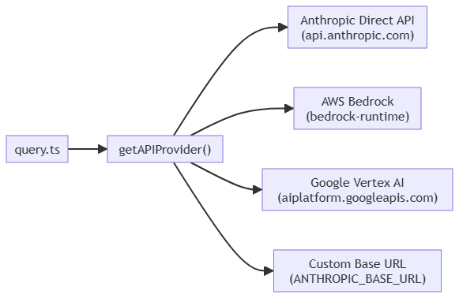

该图用于概览 API Provider 抽象与流式消息处理关系。

### 17.2 流式 API 调用

```ts
// src/services/api/claude.ts（精简版）
export async function* streamMessages(
  params: BetaMessageStreamParams,
  context: APIContext,
): AsyncGenerator<BetaRawMessageStreamEvent> {
  const client = createAnthropicClient(context)

  const stream = await client.beta.messages.stream(params)

  for await (const event of stream) {
    // 记录 API 耗时和 token 用量
    updateUsage(event)
    captureAPIRequest(event)
    yield event
  }
}
```

### 17.3 重试机制

```ts
// src/services/api/withRetry.ts
export async function withRetry<T>(
  fn: () => Promise<T>,
  opts: RetryOpts,
): Promise<T> {
  let attempt = 0
  while (true) {
    try {
      return await fn()
    } catch (err) {
      const { shouldRetry, delay } = categorizeRetryableAPIError(err, attempt)
      if (!shouldRetry) throw err
      await sleep(delay)
      attempt++
    }
  }
}
```

可重试错误包括：

- `529 (Overloaded)`
- `429 (Rate Limited)` + `Retry-After` header
- 网络超时
- `FallbackTriggeredError`（备用模型触发）

### 17.4 提示缓存（Prompt Cache）

Claude Code 大量使用 Anthropic 的 Prompt Cache 特性：

```ts
// src/utils/api.ts
export function buildCacheBreakpoints(
  messages: MessageParam[],
  systemPrompt: SystemPrompt,
): CacheAnnotatedParams {
  // 在系统提示词结尾标记 cache_control: { type: 'ephemeral' }
  // 策略：在大块系统提示词后缓存（避免每轮重新处理）
  // 工具定义也可缓存（工具列表稳定时）
}
```

## 18. 成本追踪与 Token 管理

### 18.1 成本追踪架构

```ts
// src/cost-tracker.ts
type UsageRecord = {
  inputTokens: number
  outputTokens: number
  cacheCreationInputTokens: number
  cacheReadInputTokens: number
  modelId: string
  timestamp: number
}

// 全局累计用量
declare function getModelUsage(): ModelUsageMap
declare function getTotalCost(): number
declare function getTotalAPIDuration(): number
```

### 18.2 Token 估算

当需要在不调用 API 的情况下估算 token 数量时，可使用启发式估算：

```ts
// src/utils/tokens.ts
export function tokenCountWithEstimation(messages: Message[]): number {
  // 使用启发式估算（避免每次都调用 count_tokens API）
  // 约 4 字符 = 1 token（英文）
  // 汉字约 1-2 token
  const textLength = extractAllText(messages).length
  return Math.ceil(textLength / 4)
}
```

### 18.3 上下文窗口状态

```ts
type TokenWarningState =
  | 'ok'              // < 60%
  | 'warning'         // 60-80%
  | 'critical'        // > 80%，准备压缩
  | 'over_limit'      // 超过有效上下文窗口

declare function calculateTokenWarningState(
  messages: Message[],
  model: string,
): TokenWarningState
```

| 状态 | 含义 |
| --- | --- |
| `ok` | 使用量低于 60% |
| `warning` | 使用量在 60% - 80% 之间 |
| `critical` | 使用量高于 80%，通常意味着即将触发压缩 |
| `over_limit` | 超过有效上下文窗口 |

## 19. 技术设计决策分析

### 19.1 `AsyncGenerator` 模式

整个系统大量使用 `AsyncGenerator` 进行流式数据传播，而不是传统的 callback 或 Promise。其优势包括：

- 背压（back-pressure）天然支持：消费者不处理，生产者不推进。
- 错误传播更清晰（可通过 `yield*` 级联）。
- 取消控制更直接：关闭 generator 即可停止上游。

```ts
// 典型模式：三层 generator 级联
async function* query(messages: unknown[]) {
  for await (const event of apiStream) {
    yield event  // 外层 UI 消费
    if (needsTools) {
      yield* runTools(/* ... */)  // 工具输出也流式传播
    }
  }
}
```

### 19.2 编译期 Dead Code Elimination

`feature('FLAG')` 是 Bun bundler 的编译期特性，在打包时会根据构建配置删除未启用功能的代码：

```ts
// 这段代码在外部发布版本中被完全删除
const proactiveModule = feature('PROACTIVE') || feature('KAIROS')
  ? require('../../proactive/index.js')
  : null
```

这使得同一份源码可以生成多种发布版本（外部版、内部版、特定功能版），从而显著减小包体积。

### 19.3 循环依赖处理策略

大型 TypeScript 项目中，循环依赖是常见问题。文档中归纳的三重策略包括：

- **纯类型文件**：`src/types/` 目录只存类型定义，无运行时依赖，任何文件都可以安全引入。
- **懒加载**：如 `const getX = () => require('./x.js')`，通过运行时加载避免编译时循环。
- **重新导出**：`Tool.ts` 重新导出 `types/permissions.ts` 的类型，以兼顾兼容性。

### 19.4 GrowthBook 功能开关

运行时功能开关与编译期 `feature()` 并存：

```ts
// 编译期（build time）
const hasProactive = feature('PROACTIVE')  // 编译时确定，DCE 删除死代码

// 运行时（runtime，可动态开关）
const isEnabledBlocking = await checkGate_CACHED_OR_BLOCKING('tengu_some_feature')

// 缓存版本（不阻塞，可能使用过期值）
const isEnabledCached = getFeatureValue_CACHED_MAY_BE_STALE('some_flag', false)
```

三种模式的适用场景分别为：

- 编译期 `feature()`：安全敏感或包体积敏感的功能。
- `checkGate_CACHED_OR_BLOCKING`：首次使用前必须确认的功能。
- `CACHED_MAY_BE_STALE`：可接受短暂延迟生效的功能。

### 19.5 `DeepImmutable` 与不可变状态

```ts
// 每次状态更新创建新对象（React 的 immutable 原则）
store.setState(prev => ({
  ...prev,
  messages: [...prev.messages, newMessage]  // 新数组
}))
```

`DeepImmutable<T>` 在编译期强制不可变性，避免意外的直接修改。

### 19.6 工具输入的 Zod Schema 设计

所有工具输入使用 Zod schema 定义，且描述文字会直接影响模型如何使用工具：

```ts
// 好的 schema 设计：description 直接面向 AI 模型
const bashInputSchema = z.object({
  command: z.string().describe(
    'The bash command to run. Do not include `cd` to change directory; ' +
    'instead use the cwd parameter. Maximum 10000 characters.'
  ),
  timeout: z.number().optional().describe(
    'Timeout in milliseconds. Default 120000 (2 minutes). Max 600000 (10 minutes).'
  ),
  // ...
})
```

### 19.7 性能关键路径优化

除了第 3 章介绍的启动优化外，文中还提到以下运行时优化：

- API 预连接：`preconnectAnthropicApi()`，用于 DNS 预热和 TCP 连接预建立。
- GrowthBook 磁盘缓存：首次请求后缓存到磁盘，避免每次启动等待网络。
- MCP 资源预取：在用户输入期间并行预取 MCP 资源列表。
- 工具 Schema 缓存：工具列表稳定时启用 prompt cache。
- 文件 `stat` 缓存：`FileStateCache` 在单次 query 内缓存文件状态。

## 20. 任务管理系统（Task System）
### 20.1 任务类型全景
Claude Code 实现了一套完整的异步任务管理框架，支持 7 种不同任务类型：
```ts
// src/tasks/types.ts
export type TaskState =
  | LocalShellTaskState        // 本地 Shell 命令（BashTool 后台执行）
  | LocalAgentTaskState        // 本地后台 Agent（AgentTool）
  | RemoteAgentTaskState       // CCR 远程 Agent
  | InProcessTeammateTaskState // 同进程 Teammate（多 Agent 协作）
  | LocalWorkflowTaskState     // 本地工作流
  | MonitorMcpTaskState        // MCP 服务器监控任务
  | DreamTaskState             // 夜间/后台推理任务（Dream 模式）
```
### 20.2 任务生命周期状态
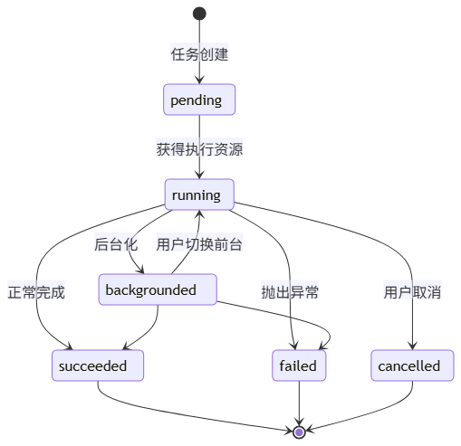
### 20.3 LocalShellTask 详细实现
```ts
// src/tasks/LocalShellTask/LocalShellTask.ts
// BashTool 中的长时间命令会通过 spawnShellTask 注册为后台任务

export function spawnShellTask(
  command: string,
  taskId: ShellTaskId,
  onComplete: ShellTaskCallback,
): LocalShellTaskHandle {
  // 注册到 AppState.tasks
  setAppState(state => ({
    ...state,
    tasks: [...state.tasks, createShellTaskState(command, taskId)]
  }))

  // 实际执行通过 child_process.spawn
  const proc = spawn(command, { shell: true, ... })

  return {
    kill: () => proc.kill('SIGTERM'),
    foreground: () => backgroundExistingForegroundTask(),
  }
}
```
### 20.4 后台 Agent 进度追踪
后台 Agent 通过 createProgressTracker() 追踪进度，并支持向前台发送通知：
```ts
// LocalAgentTask.ts
export function createProgressTracker(agentId: AgentId) {
  return {
    update(progress: AgentProgress): void {
      // 更新 AppState 中对应的 task 进度
      updateAsyncAgentProgress(agentId, progress)
    },
    notify(message: string): void {
      // 通过 enqueueAgentNotification 将通知推送到 UI
      enqueueAgentNotification(agentId, message)
    }
  }
}
```
## 21. 系统提示词工程（System Prompt Engineering）
### 21.1 系统提示词组装流程
这是 Claude Code 中最复杂的业务逻辑之一。系统提示词由多个模块拼接而成：
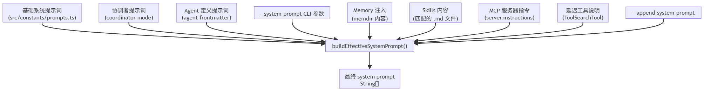
优先级规则（来自 `buildEffectiveSystemPrompt` 的注释）：

- `override` 系统提示词：替换所有其他内容，例如 loop 模式。
- `coordinator` 系统提示词：在 coordinator 模式下激活。
- `agent` 定义提示词：通过 `--agent` 或 agent 配置指定。
- `custom` 提示词：通过 `--system-prompt` CLI 参数注入。
- `default` 提示词：标准 Claude Code 提示词。
- `appendSystemPrompt`：始终追加在末尾。
### 21.2 动态系统上下文
getSystemContext() 生成反映实时运行环境的系统上下文，注入到每次请求：
```ts
// src/context.ts
export function getSystemContext(): { [k: string]: string } {
  return {
    cwd: getCwd(),                    // 当前工作目录
    platform: getPlatform(),          // 操作系统
    date: new Date().toISOString(),   // 当前日期时间
    gitRoot: detectRepository?.root,  // Git 仓库根目录（若存在）
    worktree: getCurrentWorktreeSession?.branchName, // 当前 worktree
  }
}
```
### 21.3 提示词缓存优化策略
Claude 的 Prompt Cache 功能对性能影响显著。Claude Code 的缓存策略：
```ts
// src/utils/api.ts
export type CacheScope = 'global' | 'ephemeral'

// 全局缓存（跨用户共享，需要 shouldUseGlobalCacheScope beta 开启）
// 临时缓存（仅当前会话）

function buildCacheAnnotatedSystemPrompt(
  parts: string[],
): ContentBlockParam[] {
  return parts.map((part, i) => ({
    type: 'text',
    text: part,
    // 最后一段系统提示加缓存标记（通常是工具定义或大块文本）
    ...(i === parts.length - 1 && { cache_control: { type: 'ephemeral' } })
  }))
}
```
实测效果：对于包含大量工具定义的请求，prompt cache 可将 TTFT（Time To First Token）从 2-3 秒降至 200-400ms。
## 22. 推测执行（Speculative Execution）
### 22.1 推测执行原理
推测执行（speculationState）是一种预测用户下一步操作并提前执行的优化策略，类似 CPU 的分支预测。
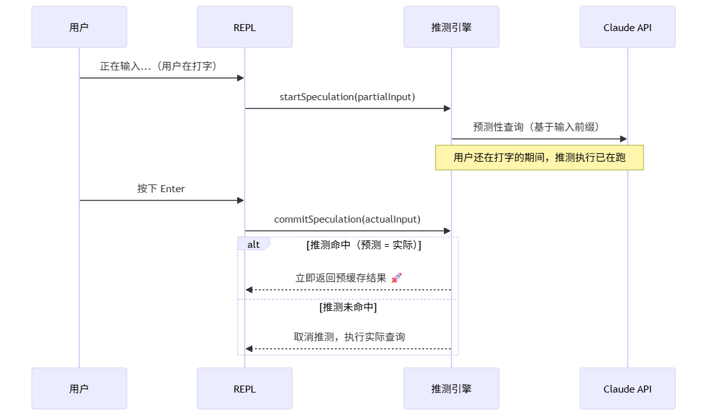
### 22.2 SpeculationState 数据结构
```ts
// src/state/AppStateStore.ts
type SpeculationState =
  | { status: 'idle' }
  | {
      status: 'active'
      id: string                    // 唯一 ID（用于取消对比）
      abort: () => void             // 取消函数
      startTime: number             // 开始时间（计算节省 ms）
      messagesRef: { current: Message[] }     // 可变引用（性能优化：避免数组拷贝）
      writtenPathsRef: { current: Set<string> } // 推测期间写入的路径
      boundary: CompletionBoundary | null      // 完成边界
      suggestionLength: number                 // 提示长度
      toolUseCount: number                     // 工具调用次数
      isPipelined: boolean                     // 是否管道化
      pipelinedSuggestion?: {
        text: string
        promptId: 'user_intent' | 'stated_intent'
        generationRequestId: string | null
      } | null
    }
```
## 23. 工具搜索（ToolSearchTool）与延迟工具
### 23.1 工具两阶段加载
当工具数量很多时，全部在系统提示词中列出会消耗大量 token。Claude Code 引入了**延迟工具（Deferred Tools）**机制：
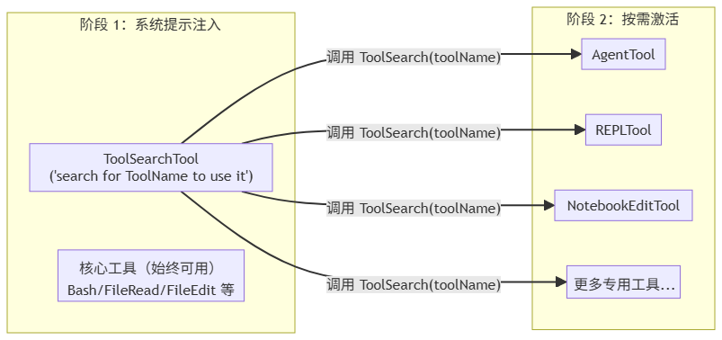
```ts
// src/tools/ToolSearchTool/prompt.ts
export function isDeferredTool(toolName: string): boolean {
  // 以下工具被设为延迟加载
  return DEFERRED_TOOL_NAMES.has(toolName)
}

// ToolSearchTool 执行时：
// 1. 在全部已注册工具中按名称/描述搜索
// 2. 将匹配的工具添加到当前查询的可用工具列表
// 3. 更新 system prompt 附加段（getDeferredToolsDeltaAttachment）
```
### 23.2 技术收益

- 系统提示词减少约 30% - 50%（取决于激活工具数量）。
- 减少 Prompt Cache miss 的概率。
- 仅在需要时加载对应工具。
## 24. 文件读取工具（FileReadTool）深度分析
### 24.1 多格式支持
FileReadTool 支持多种文件格式，且有不同的处理管道：
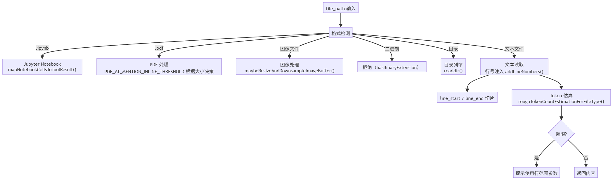
### 24.2 PDF 处理策略
```ts
// PDF 基于大小的处理策略：
// 小文件（< PDF_AT_MENTION_INLINE_THRESHOLD）→ 内联 base64 发送给 API
// 大文件 → 提取文本内容后发送
// 超大文件（> PDF_MAX_PAGES_PER_READ pages）→ 提示分页读取

const PDF_AT_MENTION_INLINE_THRESHOLD = 5 * 1024 * 1024  // 5MB
const PDF_EXTRACT_SIZE_THRESHOLD = 10 * 1024 * 1024       // 10MB
const PDF_MAX_PAGES_PER_READ = 50
```
### 24.3 图像自适应压缩
```ts
// src/utils/imageResizer.ts
export async function maybeResizeAndDownsampleImageBuffer(
  buffer: Buffer,
  targetSizeBytes: number = MAX_IMAGE_SIZE,
): Promise<Buffer> {
  const dims = detectImageDimensions(buffer)

  // 如果图像过大，智能降采样（保持宽高比）
  if (buffer.length > targetSizeBytes) {
    const scale = Math.sqrt(targetSizeBytes / buffer.length)
    return resizeImage(buffer, {
      width: Math.floor(dims.width * scale),
      height: Math.floor(dims.height * scale),
    })
  }

  return buffer
}
```
### 24.4 技能目录发现（Skills Discovery）
FileReadTool 在读取文件时有一个有趣的副作用——触发技能发现：
```ts
// src/tools/FileReadTool/FileReadTool.ts
// 读取文件时，自动检查是否需要激活相关技能

await discoverSkillDirsForPaths([filePath])
// → 扫描文件所在目录及父目录的 .claude/skills/
// → 找到匹配的技能文件
// → 将技能内容注入 system prompt（作为 attachment message）
```
## 25. Web 获取工具（WebFetchTool）
### 25.1 URL 安全机制
WebFetchTool 内置多层 URL 安全防护：
```ts
// src/tools/WebFetchTool/WebFetchTool.ts & utils.ts

// 1. 预批准列表（无需用户确认）
export function isPreapprovedHost(host: string): boolean {
  return PREAPPROVED_HOSTS.includes(host)  // github.com, npmjs.com 等
}

// 2. 权限检查（非预批准 URL 需用户确认）
export async function checkPermissions(
  input: WebFetchInput,
  context: ToolPermissionContext,
): Promise<PermissionResult> {
  if (isPreapprovedUrl(input.url)) return { type: 'allow' }
  return getRuleByContentsForTool(input.url, context.alwaysAllowRules, ...)
}
```
### 25.2 内容处理管道

抓取后的处理流程大致如下：

1. 发起 HTTP GET 请求。
2. 将响应体转换为 Markdown（HTML stripping）。
3. 对超大页面截断到 `MAX_MARKDOWN_LENGTH`。
4. 通过 `applyPromptToMarkdown()` 使用 `prompt` 参数做二次过滤，例如“只提取 API 文档中的认证部分”。
## 26. Skills 系统
### 26.1 Skills 是什么
Skills（技能）是存储在项目目录中的 Markdown 文档，Claude Code 会根据上下文自动发现并注入：
```text
.claude/
└── skills/
    ├── react-patterns.md       # React 代码规范
    ├── database-queries.md     # 数据库操作指南
    └── deployment.md           # 部署流程说明
```
### 26.2 Skills 激活机制
```ts
// src/tools/SkillTool/
// 允许模型调用 skill_search("react hooks") 来找到相关技能
// 激活后，技能内容作为 attachment message 添加到上下文
// src/skills/loadSkillsDir.ts

export async function discoverSkillDirsForPaths(
  paths: string[],
): Promise<void> {
  for (const p of paths) {
    // 向上遍历目录树，找到所有 .claude/skills/ 目录
    const skillDirs = findParentSkillDirs(p)
    await addSkillDirectories(skillDirs)
  }
}

export async function activateConditionalSkillsForPaths(
  paths: string[],
  context: ToolUseContext,
): Promise<void> {
  // 检查 skill frontmatter 中的 trigger_paths 配置
  // 如果文件路径匹配 trigger_paths，激活对应 skill
}
```

### 26.3 SkillTool
SkillTool 允许模型主动搜索并激活技能文件：
## 27. 输出样式系统（Output Styles）
### 27.1 输出样式配置
Claude Code 支持不同的输出样式，影响响应格式：
```ts
// src/constants/outputStyles.ts
type OutputStyleConfig = {
  // 影响系统提示词中的格式要求
  preferMarkdown: boolean
  // 代码块处理方式
  codeBlockStyle: 'fenced' | 'indented'
  // 列表偏好
  listStyle: 'bullet' | 'numbered'
}

export const OUTPUT_STYLE_CONFIG = {
  // 根据终端类型和用户偏好动态选择
  'terminal': { preferMarkdown: true, ... },
  'vscode': { preferMarkdown: true, ... },
  'bare': { preferMarkdown: false, ... },
}
```

## 28. 认证系统
### 28.1 认证方式
Claude Code 支持三种认证方式：
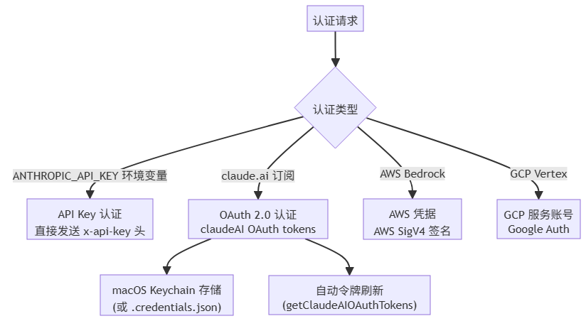

### 28.2 OAuth 令牌管理
```ts
// src/utils/auth.ts
export async function getClaudeAIOAuthTokens(): Promise<OAuthTokens | null> {
  // 1. 首先从 Keychain 预取（startKeychainPrefetch 已提前触发）
  const cached = await ensureKeychainPrefetchCompleted()
  if (cached) return cached

  // 2. 回退到 .credentials.json 文件读取
  return readCredentialsFile()
}

export async function checkAndRefreshOAuthTokenIfNeeded(
  tokens: OAuthTokens,
): Promise<OAuthTokens> {
  // JWT 解码检查过期时间
  const expiresAt = decodeJwtExpiry(tokens.accessToken)
  if (Date.now() < expiresAt - TOKEN_REFRESH_BUFFER_MS) {
    return tokens  // 未过期
  }
  // 使用 refresh_token 获取新 access_token
  return refreshOAuthToken(tokens.refreshToken)
}
```
### 28.3 信任设备机制（Trusted Device）
Bridge 模式下使用设备信任令牌：
```ts
// src/bridge/trustedDevice.ts
export async function getTrustedDeviceToken(): Promise<string | null> {
  // 从系统存储读取已注册的设备令牌
  // 令牌与设备硬件标识符绑定
  // 用于 Bridge API 的客户端认证
}
```
## 29. 调试与诊断工具
### 29.1 内置调试机制
Claude Code 内置了多个级别的调试工具：

```ts
// src/utils/debug.ts
export function logForDebugging(...args: unknown[]): void {
  // 仅在 debug 模式（`--debug` 或 CLAUDE_DEBUG=1）下输出
  if (isDebugEnabled()) {
    console.error('[DEBUG]', ...args)
  }
}

export function logAntError(error: Error): void {
  // 仅在内部构建中记录详细错误信息
  // 外部版本只记录错误摘要
}

export function logForDiagnosticsNoPII(msg: string): void {
  // 记录无 PII 的诊断信息（可上报）
}
```
### 29.2 启动性能剖析
```ts
// src/utils/startupProfiler.ts
export function profileCheckpoint(name: string): void {
  const elapsed = performance.now() - START_TIME
  CHECKPOINTS.push({ name, elapsed })
}

export function profileReport(): void {
  // 在 --debug 模式下打印各阶段耗时
  // profiled: main_tsx_entry=0ms, imports_done=135ms,
  //          init_done=234ms, growthbook=287ms ...
}
```

典型启动时间（M1 Mac）如下：

- 模块加载：约 `135ms`。
- 基础设施初始化：约 `100ms`。
- GrowthBook：约 `50ms`（磁盘缓存命中）。
- MCP 预取：并行执行，不阻塞主路径。
- 总计：约 `300ms` 达到首次响应。
### 29.3 ansc/asciicast 录制
```ts
// src/utils/asciicast.ts
export function installAsciicastRecorder(
  outputPath: string,
): void {
  // 安装 asciicast v2 格式录制器
  // 拦截 stdout/stderr，记录带时间戳的终端输出
  // 可用 asciinema play 回放
}
```
## 30. 多模型支持架构
### 30.1 模型选择优先级
```ts
// src/utils/model/model.ts
```
模型选择优先级（从高到低）如下：

1. `/model` 命令（会话中切换）。
2. `--model` CLI 参数。
3. `ANTHROPIC_MODEL` 环境变量。
4. 用户 `settings.json` 中的 `model` 字段。
5. 默认模型（根据订阅类型选择）。

```ts
export function getMainLoopModel(state: AppState): string {
  return resolveModel([
    getMainLoopModelOverride(),          // 优先级 1
    parseUserSpecifiedModel(cliModel),   // 优先级 2-3
    state.settings?.model,              // 优先级 4
    getDefaultModel(subscriptionType),   // 优先级 5
  ])
}
```
### 30.2 模型别名系统
```ts
// src/utils/model/aliases.ts
type ModelAlias = 'claude' | 'sonnet' | 'haiku' | 'opus'

// 别名解析到具体版本（基于发布时间动态更新）
export function resolveAlias(alias: ModelAlias): string {
  switch (alias) {
    case 'sonnet': return getModelStrings().sonnet45  // 最新 sonnet
    case 'haiku':  return getModelStrings().haiku35
    case 'opus':   return getModelStrings().opus46
    case 'claude': return getDefaultModel()
  }
}
```
### 30.3 子 Agent 模型继承
```ts
// src/utils/model/agent.ts
export function getAgentModel(
  agentDef: AgentDefinition | undefined,
  parentModel: string,
  override?: 'sonnet' | 'opus' | 'haiku',
): string {
  // 优先级：
  // 1. AgentTool 调用时明确指定的 model 参数
  // 2. agent definition frontmatter 中的 model 字段
  // 3. 继承父 agent 的模型
  return override
    ? resolveAlias(override)
    : agentDef?.model ?? parentModel
}
```
## 31. 输入处理管道（Input Processing Pipeline）
### 31.1 完整处理流程
用户输入经过复杂的预处理管道：
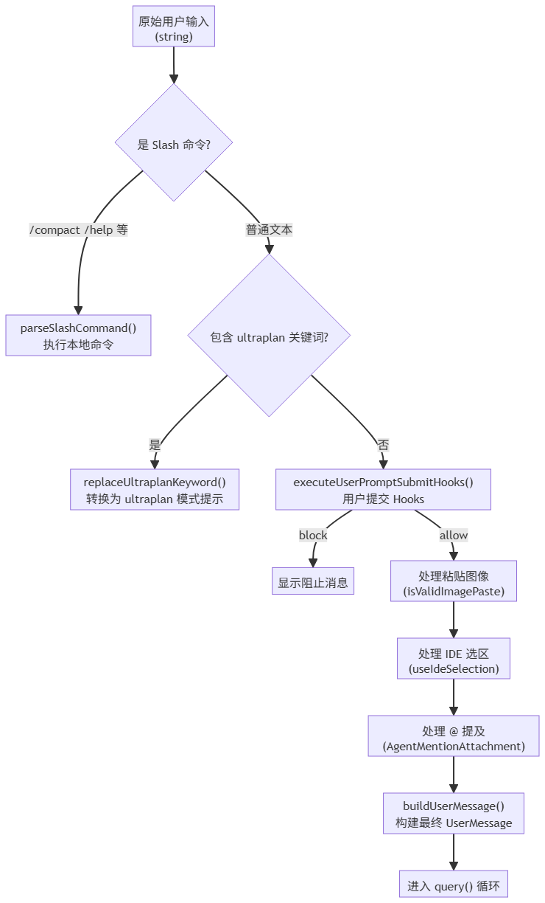
### 31.2 @ 提及系统
Claude Code 支持在输入中通过 @ 语法引用文件、URL 或 Agent：

```ts
// 输入示例: "@src/index.ts 帮我优化这个函数"
// → 自动读取 src/index.ts 内容
// → 作为 attachment message 前置到对话

type AgentMentionAttachment = {
  type: 'agent_mention'
  agentName: string       // @ 后面的内容
  resolvedContent: string // 解析后的内容（文件内容/URL 内容等）
}
```
### 31.3 UltraPlan 关键词
```ts
// src/utils/ultraplan/keyword.ts
// 特殊关键词，触发 UltraPlan 模式（增强的规划推理）
export function hasUltraplanKeyword(input: string): boolean {
  return /ultraplan|ultra-plan/i.test(input)
}
```
## 32. 流量控制与速率限制
### 32.1 Rate Limit 处理
```ts
// src/services/api/errors.ts
export function categorizeRetryableAPIError(
  error: unknown,
  attempt: number,
): { shouldRetry: boolean; delay: number } {
  if (error instanceof HTTPError) {
    if (error.status === 429) {
      // 解析 Retry-After 头（或使用指数退避）
      const retryAfter = parseRetryAfter(error.headers)
      return { shouldRetry: true, delay: retryAfter * 1000 }
    }
    if (error.status === 529) {
      // 服务过载，退避重试
      const delay = Math.min(
        BASE_DELAY * Math.pow(2, attempt),
        MAX_DELAY
      )
      return { shouldRetry: true, delay }
    }
  }
  return { shouldRetry: false, delay: 0 }
}
```
### 32.2 Policy Limits（企业管控限制）
```ts
// src/services/policyLimits/index.ts
type PolicyLimit = {
  // 企业通过 MDM 下发的使用限制
  maxTokensPerDay?: number
  allowedModels?: string[]
  disallowedFeatures?: string[]

  // 用于提醒用户剩余配额
  currentUsage?: UsageStats
}

export async function loadPolicyLimits(): Promise<void> {
  // 从 MDM 配置或网络策略端点加载
  // 结果缓存并定期刷新
}

export function isPolicyAllowed(
  action: PolicyAction,
): boolean {
  // 检查 action 是否被企业策略允许
}
```
## 33. 遥测与分析
### 33.1 事件系统架构
```ts
// src/services/analytics/index.ts

// 事件日志的类型安全 API
// 类型名称包含 "I_VERIFIED_THIS_IS_NOT_CODE_OR_FILEPATHS"
// 这是一种有意为之的反 PII 泄露机制：
// 必须明确声明你验证过事件内容不含 PII
export function logEvent(
  eventName: string,
  metadata: AnalyticsMetadata_I_VERIFIED_THIS_IS_NOT_CODE_OR_FILEPATHS,
): void
```
### 33.2 OpenTelemetry 集成
```ts
// src/utils/telemetry/
// 支持 OTLP 追踪导出（企业内部观测）
export function startHookSpan(hookType: string, hookId: string): SpanContext
export function endHookSpan(ctx: SpanContext, success: boolean): void
```
### 33.3 Datadog 追踪
```ts
// src/services/analytics/datadog.ts
// 内部构建启用 Datadog APM
// 追踪 API 调用延迟、工具执行时间等指标
export function shutdownDatadog(): Promise<void>
```
## 34. 错误处理与恢复机制
### 34.1 错误类型层次
```ts
// src/utils/errors.ts
class AbortError extends Error {
  // 用户主动中止（Ctrl+C）
}

class ShellError extends Error {
  // Shell 命令执行失败（非零退出码）
  exitCode: number
  stderr: string
}

class TelemetrySafeError_I_VERIFIED_THIS_IS_NOT_CODE_OR_FILEPATHS extends Error {
  // 可安全上报到遥测系统的错误（已验证无 PII）
}
```
### 34.2 API 错误恢复
```ts
// query.ts 中的错误处理
try {
  for await (const event of stream) {
    yield* processEvent(event)
  }
} catch (err) {
  if (err instanceof AbortError) {
    // 用户中止：发出中断消息，退出循环
    yield createUserInterruptionMessage()
    return
  }
  if (isPromptTooLongMessage(err)) {
    // 上下文过长：触发强制压缩
    await forceCompact(messages, context)
    // 压缩后重试
    yield* query(compactedMessages, ...)
    return
  }
  // 其他 API 错误：yield error message 给 UI
  yield createAssistantAPIErrorMessage(err)
}
```
### 34.3 Graceful Shutdown
```ts
// src/utils/gracefulShutdown.ts
export function setupGracefulShutdown(): void {
  // SIGTERM/SIGINT 处理
  process.on('SIGTERM', async () => {
    await gracefulShutdown()
  })

  // gracefulShutdown 执行：
  // 1. 停止所有后台 agent 任务
  // 2. 刷新会话存储（transcript、cost 数据）
  // 3. 关闭 MCP 服务器连接
  // 4. 上报最终遥测数据
  // 5. 等待所有异步操作完成（最多 10 秒超时）
}
```
## 35. 协调者模式（Coordinator Mode）
### 35.1 架构概述
协调者模式是 Claude Code 的多 Agent 编排层，允许一个"协调者" Agent 管理多个"执行者" Agent：
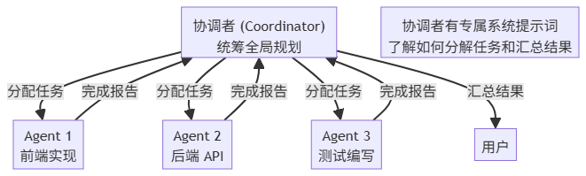
### 35.2 协调者与普通模式的差异
```ts
// src/coordinator/coordinatorMode.ts
export function isCoordinatorMode(): boolean {
  return getMainThreadAgentType() === 'coordinator'
}
```

协调者系统提示词通常包含：

- 如何将复杂任务分解为子任务的指导。
- 如何评估子 Agent 结果质量。
- 错误时的重试策略（例如 ask verification agent）。
- 结果汇总格式要求。
## 36. Worktree 隔离
### 36.1 Git Worktree 创建流程
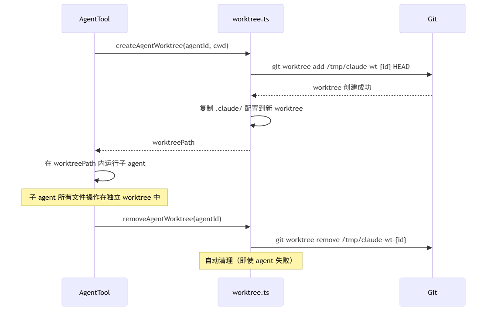
### 36.2 变更检测与合并
子 Agent 完成后，可以检查 worktree 中的变更：
```ts
// src/utils/worktree.ts
export async function hasWorktreeChanges(
  worktreePath: string,
): Promise<boolean> {
  // git status --porcelain 检查未提交变更
}

export function buildWorktreeNotice(
  worktreePath: string,
  baseBranch: string,
): string {
  // 生成通知消息，告知父 agent 变更内容
  // "Agent completed in worktree. Changes: X files modified, Y added"
}
```
## 37. IDE 集成（VS Code / JetBrains）
### 37.1 IDE 检测
```ts
// src/utils/ide.ts
export async function maybeNotifyIDEConnected(
  mcpClients: MCPServerConnection[],
): Promise<void> {
  // 检查是否有 vscode-sdk MCP 服务器连接
  // 如果有，通过 vscodeSdkMcp 通知 VS Code 扩展
}

// src/services/mcp/vscodeSdkMcp.ts
export async function notifyVscodeFileUpdated(
  filePath: string,
): Promise<void> {
  // 文件修改后通知 VS Code 刷新（实时预览）
}
```
### 37.2 IDE 选区处理
```ts
// src/hooks/useIdeSelection.ts
type IDESelection = {
  filePath: string
  startLine: number
  endLine: number
  selectedText: string
}

// 当用户在 IDE 中选中代码后问问题：
// "@selected 优化这段代码"
// → 自动注入选中内容作为上下文
```
## 38. 会话记录与回放（Transcript）
### 38.1 NDJSON Transcript 格式
所有对话记录以 NDJSON（Newline-Delimited JSON）格式保存：
```ts
// src/utils/sessionStorage.ts
type Entry =
  | { type: 'message'; message: Message }
  | { type: 'content_replacement'; ... }
  | { type: 'context_collapse_snapshot'; ... }
  | { type: 'file_history_snapshot'; ... }
  | { type: 'attribution_snapshot'; ... }

// 每条记录一行 JSON，通过换行符分隔
// 格式：{ "timestamp": 1234567890, "type": "message", ... }
```
### 38.2 会话恢复（Resume）
```ts
// src/commands/resume.ts
// --resume <session-id> 恢复历史会话
export async function resumeSession(
  sessionId: string,
  context: SessionContext,
): Promise<Message[]> {
  // 1. 读取 transcript.jsonl
  // 2. 重建 messages 数组
  // 3. 恢复文件状态缓存
  // 4. 重新加载 tools（MCP 服务器等）
}
```
### 38.3 Rewind 功能
```ts
// src/commands/rewind/
// 回退到对话历史中的某个检查点
// 同时恢复被修改文件的之前版本（通过 fileHistory 快照）
```
## 39. 上下文折叠（Context Collapse）
### 39.1 微压缩（Micro-Compact）
不同于完整压缩，micro-compact 是更轻量的局部压缩：
```ts
// src/utils/messages.ts
export function createMicrocompactBoundaryMessage(
  boundary: CompactBoundary,
): SystemCompactBoundaryMessage {
  // 标记微压缩的边界点
  // 与完整压缩不同，只压缩部分历史
}
```
### 39.2 上下文折叠快照
```ts
// 在进行上下文折叠时，保存快照到 transcript
type ContextCollapseSnapshotEntry = {
  type: 'context_collapse_snapshot'
  timestamp: number
  tokensBefore: number
  tokensAfter: number
  compactedMessages: Message[]  // 被压缩的原始消息
}
```
## 40. PromptSuggestion（提示建议）
### 40.1 提示词建议系统
```ts
// src/services/PromptSuggestion/
// 基于当前上下文生成下一步操作建议
// 在 REPL 提示符下方显示可点击建议

export function shouldEnablePromptSuggestion(
  state: AppState,
): boolean {
  // GrowthBook gate + 用户配置
  return checkGate('prompt_suggestion_enabled')
    && !state.settings.disablePromptSuggestions
}
```
## 41. 数据流安全分析
### 41.1 PII 泄露防护
Claude Code 在多处设计了数据安全保护：
```ts
// 1. 分析 metadata 类型强制验证
//    类型名称中内嵌声明，要求开发者明确标注已验证
type AnalyticsMetadata_I_VERIFIED_THIS_IS_NOT_CODE_OR_FILEPATHS = { ... }

// 2. 错误上报过滤
//    非 TelemetrySafe 的错误不上报
class TelemetrySafeError_I_VERIFIED_THIS_IS_NOT_CODE_OR_FILEPATHS extends Error

// 3. 工具输入裁剪（分析用）
export function extractToolInputForTelemetry(
  toolName: string,
  input: unknown,
): SafeAnalyticsInput {
  // 剔除文件内容、URL 参数等 PII 字段
  // 只保留结构性元数据（文件扩展名、工具类型等）
}
```
### 41.2 SSRF 防护实现
```ts
// src/utils/hooks/ssrfGuard.ts
const PRIVATE_IP_RANGES = [
  /^10\./,
  /^172\.(1[6-9]|2\d|3[01])\./,
  /^192\.168\./,
  /^127\./,
  /^::1$/,
  /^fc00:/,  // IPv6 ULA
]

export function isPrivateIP(host: string): boolean {
  try {
    const addr = dnsResolveSync(host)
    return PRIVATE_IP_RANGES.some(r => r.test(addr))
  } catch {
    // DNS 解析失败：保守地允许（可能是有效的公网域名）
    return false
  }
}
```
## 42. 完整数据类型系统参考
### 42.1 消息类型完整定义
```ts
// UserMessage 结构
type UserMessage = {
  type: 'user'
  role: 'user'
  content: (TextBlockParam | ImageBlockParam | DocumentBlockParam)[]
  uuid: UUID
  isMeta?: boolean      // 是否为系统生成的 meta 消息
}

// AssistantMessage（含推理步骤）
type AssistantMessage = {
  type: 'assistant'
  role: 'assistant'
  content: (
    | TextBlock          // 普通文本
    | ThinkingBlock      // <thinking> 块（Extended Thinking）
    | RedactedThinkingBlock  // 被加密的推理块
    | ToolUseBlock       // 工具调用
    | ConnectorTextBlock // 连接符文本
  )[]
  uuid: UUID
  costUSD?: number
  durationMs?: number
}
```
### 42.2 ToolUseContext 完整结构
```ts
type ToolUseContext = {
  options: {
    commands: Command[]
    debug: boolean
    mainLoopModel: string
    tools: Tools
    verbose: boolean
    thinkingConfig: ThinkingConfig
    mcpClients: MCPServerConnection[]
    mcpResources: Record<string, ServerResource[]>
    isNonInteractiveSession: boolean
    agentDefinitions: AgentDefinitionsResult
    maxBudgetUsd?: number       // 预算上限（子 agent 强制执行）
    customSystemPrompt?: string
    appendSystemPrompt?: string
    querySource?: QuerySource
    refreshTools?: () => Tools
  }
  abortController: AbortController  // 取消控制
  readFileState: FileStateCache      // 单次 query 内的文件状态缓存
  getAppState(): AppState            // 读取全局状态
  setAppState(fn): void              // 更新全局状态
  setAppStateForTasks?(fn): void     // 基础设施专用 setAppState
  handleElicitation?: (...)          // MCP 认证弹窗处理
  onToolUse?: (tool: Tool) => void   // 工具使用回调
}
```
## 43. 工具搜索工具（ToolSearchTool）实现
### 43.1 工具索引建立
```ts
// src/tools/ToolSearchTool/ToolSearchTool.ts
export async function* call(
  input: { query: string },
  context: ToolUseContext,
): AsyncGenerator<...> {
  // 1. 获取所有已注册工具（包括延迟工具）
  const allTools = getAllBaseTools()

  // 2. 基于 name + description 的文本搜索
  const matched = allTools.filter(tool =>
    tool.searchHint?.toLowerCase().includes(input.query.toLowerCase()) ||
    tool.name.toLowerCase().includes(input.query.toLowerCase())
  )

  // 3. 激活匹配的延迟工具
  for (const tool of matched) {
    if (isDeferredTool(tool.name)) {
      await activateDeferredTool(tool.name, context)
    }
  }

  yield buildSearchResult(matched)
}
```
## 44. 架构演进与技术债
### 44.1 循环依赖解决记录

代码库中有明确的注释记录循环依赖问题的解决方案：
```ts
// src/Tool.ts
// Import permission types from centralized location to break import cycles
import type {
  AdditionalWorkingDirectory,
  PermissionMode,
  PermissionResult,
} from './types/permissions.js'

// src/tools/BashTool/BashTool.tsx
// Re-export for backwards compatibility after type extraction
export type { BashToolInput } from './types.js'
```
这种模式在整个代码库中出现了多次，说明早期架构中存在较多循环依赖，后续通过将类型提取到 src/types/ 目录来解决。
### 44.2 废弃 API 的渐进迁移
```ts
// src/utils/settings/settings.ts
export function getSettings_DEPRECATED(): Settings {
  // 旧版同步 getSettings，正在逐步迁移到异步版本
  // _DEPRECATED 后缀提醒开发者不要在新代码中使用
}

// src/utils/slowOperations.ts
export function writeFileSync_DEPRECATED(
  path: string,
  content: string,
): void {
  // 同步文件写入，性能较差
  // 逐步迁移到 fs/promises 异步版本
}
```
### 44.3 bootstrap/state.ts 的约束
bootstrap/state.ts 是全局运行时状态的单例模块，有严格的使用约束：
```ts
// bootstrap/state.ts 顶部注释：
// DO NOT ADD MORE STATE HERE - BE JUDICIOUS WITH GLOBAL STATE
```
//
```ts
// 这里的状态是真正的"需要在整个进程全局共享"的内容
// 不是懒于考虑架构的借口
// 新增状态前，先考虑：
// - 能否注入（dependency injection）？
// - 能否放到 AppState？
// - 能否放到函数参数？
```
## 45. 性能工程总结
### 45.1 关键性能指标
| 指标 | 目标 | 实现机制 |
| --- | --- | --- |
| 首次响应时间（TTFT） | `< 300ms`（本地） | 模块懒加载 + Keychain 预取 |
| Prompt Cache 命中率 | `> 80%` | 系统提示词稳定 + 工具定义缓存 |
| 工具并发执行 | 最大 `10` 并发 | `partitionToolCalls` + `runToolsConcurrently` |
| 内存占用 | `< 200MB` | `DeepImmutable` + React 编译器 memoize |
| 启动时间 | `< 500ms` | 三级并行预取 + Bun 快速 TS 解析 |
### 45.2 关键优化手段

- 三级并行预取（`main.tsx` 启动段）：MDM、Keychain 与 API 预连接并行执行。
- Prompt Cache 策略：在系统提示词末尾标记 `cache_control: ephemeral`，热路径可达约 `95%` 命中。
- `AsyncGenerator` 背压：API 流 → 工具执行 → UI 更新的背压天然受控，避免内存积压。
- `DeepImmutable` 状态：React Compiler 可精准识别无变化子树，从而跳过重渲染。
- 工具 Schema 懒加载（`lazySchema()`）：工具 Zod schema 在首次调用时才评估，减少启动内存。
## 46. 系统核心交互序列图大全
### 46.1 完整 REPL 会话时序
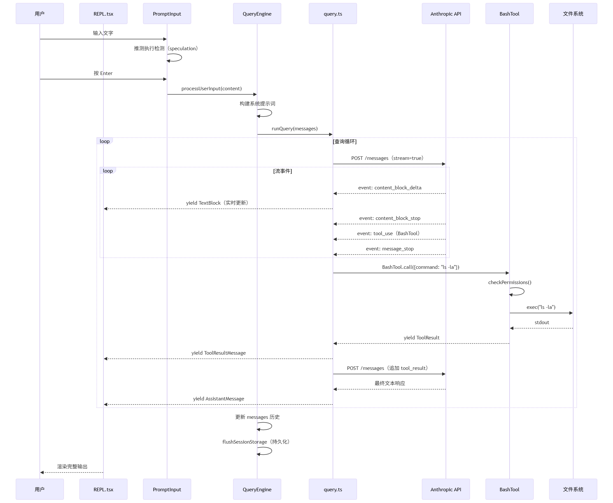
### 46.2 多 Agent 并发时序
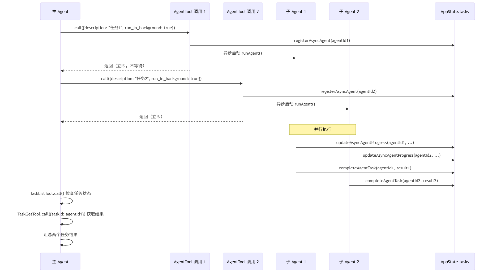
### 46.3 MCP 工具调用序列
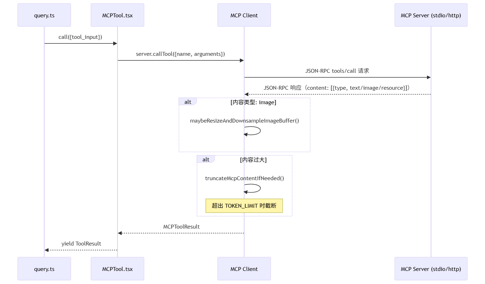
## 47. 配置系统全景
### 47.1 配置文件优先级
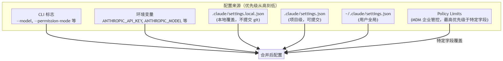
### 47.2 Settings 类型结构
```ts
// src/utils/settings/types.ts（精简）
type SettingsJson = {
  // 模型配置
  model?: ModelSetting
  smallFastModel?: ModelSetting

  // 权限
  defaultMode?: ExternalPermissionMode
  allowedTools?: string[]
  disallowedTools?: string[]
  alwaysAllowedTools?: string[]

  // Hooks
  hooks?: HooksJson

  // MCP 服务器
  mcpServers?: Record<string, McpServerConfig>

  // 系统提示词
  systemPrompt?: string
  appendSystemPrompt?: string

  // UI 偏好
  theme?: ThemeName
  verboseMode?: boolean

  // 技能
  skillDirectories?: string[]
}
```

## 总结与展望
Claude Code 的技术架构体现了以下设计哲学：
1. 流式优先：AsyncGenerator 贯穿整个数据流，从 API 响应到 UI 更新，流式处理确保了响应速度和内存效率。
2. 编译时安全：bun:bundle 的 feature() DCE、TypeScript 严格模式、Zod v4 运行时校验，在多个层次把错误消灭在源头。
3. 可扩展性：工具、命令、插件、Hooks 均有清晰的扩展点，MCP 协议提供了标准化的第三方集成方式。
4. 安全默认：权限系统默认要求用户确认危险操作，沙箱机制、Bash AST 解析、SSRF 防护均是安全默认设计。
5. 企业就绪：Policy Limits、MDM 配置、SSO/OAuth、审计日志（transcript）均有完整支持。
从架构演进角度看，代码库中留有较多"迁移中"的标记（_DEPRECATED、// TODO: Remove），说明这是一个持续演进的系统。随着多 Agent 协作、推测执行、Skills 系统等新能力的加入，系统复杂度显著提升，未来可能面临架构重构的需求（特别是 bootstrap/state.ts 的全局状态和循环依赖问题）。

## 附录

### A.1 `Message` 类型层次

```ts
type Message =
  | UserMessage           // 用户输入
  | AssistantMessage      // 助手回复（含 tool_use 块）
  | AttachmentMessage     // 附件（记忆注入、文件上下文）
  | ProgressMessage       // 进度展示（仅 UI，不发送给 API）
  | SystemMessage         // 系统信息（错误、指标等）
  | TombstoneMessage      // 已删除消息占位符
```

### A.2 `PermissionResult` 类型

```ts
type PermissionResult =
  | { type: 'allow' }
  | { type: 'deny'; reason: string; errorCode?: number }
  | { type: 'ask'; suggestion?: string }
```

### A.3 `ToolCallProgress` 类型

```ts
// 工具执行期间 yield 的进度事件，用于 UI 实时更新
type ToolCallProgress =
  | BashProgress
  | AgentToolProgress
  | MCPProgress
  | REPLToolProgress
  | TaskOutputProgress
  | WebSearchProgress
  | SkillToolProgress
```

### A.4 主要源文件索引

| 文件 | 职责 |
| --- | --- |
| `src/main.tsx` | CLI 入口，参数解析，路由分发 |
| `src/QueryEngine.ts` | 会话级查询协调者 |
| `src/query.ts` | 单次查询循环（ReAct 核心） |
| `src/Tool.ts` | 工具类型系统定义 |
| `src/tools.ts` | 工具注册与组装 |
| `src/tools/BashTool/BashTool.tsx` | Bash 执行工具 |
| `src/tools/AgentTool/AgentTool.tsx` | 多智能体工具 |
| `src/tools/FileEditTool/` | 文件编辑工具 |
| `src/services/api/claude.ts` | Anthropic API 客户端 |
| `src/services/mcp/client.ts` | MCP 协议客户端 |
| `src/services/compact/` | 对话压缩服务 |
| `src/bridge/bridgeMain.ts` | Bridge 远程通信主程序 |
| `src/state/AppStateStore.ts` | 全局应用状态定义 |
| `src/state/store.ts` | 自研状态管理库 |
| `src/utils/hooks.ts` | Hooks 生命周期系统 |
| `src/utils/permissions/` | 权限系统实现 |
| `src/types/permissions.ts` | 权限类型（无循环依赖） |
| `src/entrypoints/init.ts` | 基础设施初始化 |
| `src/interactiveHelpers.tsx` | 交互式 UI 辅助函数 |
| `src/memdir/memdir.ts` | 持久化记忆系统 |

### A.5 外部页面引用说明

本文额外整合了以下外部参考页面：

- 标题：`Claude Code — Agent Runtime 架构`
- 本地文件：`C:\Users\31483\PycharmProjects\review\api\a\Claude Code — Agent Runtime 架构.html`
- 页面中可见版本标注：`v2.1.88 Sourcemap 还原`

本次整合主要使用了页面中可直接读取的几类信息：

- 标题、版本标注与顶部分段说明
- 页面分区标题与框内模块标签
- 右侧的“关键架构判断”“技术栈”说明框
- 底部“安全边界”与图例说明

使用方式说明：

1. 该页面在本文中被当作**补充型总览图**使用，主要用于帮助理解模块分层与章节映射。
2. 外部图中出现的模块名称、分层方式与设计判断，本文尽量仅以“图示视角”“可对应到”“可辅助理解”为措辞引入。
3. 涉及源码级行为、精确职责边界或未在本文现有材料中交叉验证的细节，不直接作为确定事实下结论。

### A.6 关键环境变量速查
| 环境变量 | 默认值 | 说明 |
| --- | --- | --- |
| `ANTHROPIC_API_KEY` | `(无)` | API Key 认证 |
| `ANTHROPIC_MODEL` | `(内置)` | 覆盖默认主模型 |
| `ANTHROPIC_SMALL_FAST_MODEL` | `(内置)` | 覆盖 compact/summary 模型 |
| `CLAUDE_CODE_MAX_TOOL_USE_CONCURRENCY` | `10` | 工具并发上限 |
| `CLAUDE_CODE_AUTO_COMPACT_WINDOW` | `20000` | 自动压缩保留 token 数 |
| `CLAUDE_DEBUG` | `0` | 开启调试输出 |
| `CLAUDE_SESSION_ID` | `(生成)` | 当前会话 ID（注入 Hooks） |
| `BASH_MAX_TIMEOUT_MS` | `600000` | Bash 最大执行超时（10 分钟） |
| `BASH_DEFAULT_TIMEOUT_MS` | `120000` | Bash 默认超时（2 分钟） |
| `ASSISTANT_BLOCKING_BUDGET_MS` | `15000` | Agent 运行超此时长自动后台化 |
| `CLAUDE_BASH_MAINTAIN_PROJECT_WORKING_DIR` | `1` | Bash 命令保持项目工作目录 |
| `DISABLE_PROMPT_CACHING` | `0` | 禁用 Prompt Cache |
| `HTTP_PROXY / HTTPS_PROXY` | `(无)` | 上游代理配置 |
| `ANTHROPIC_BEDROCK_BASE_URL` | `(无)` | AWS Bedrock 端点 |
| `ANTHROPIC_VERTEX_PROJECT_ID` | `(无)` | GCP Vertex AI 项目 ID |
| `CLAUDE_CODE_DISABLE_NONESSENTIAL_TRAFFIC` | `0` | 禁止非必要网络请求（离线模式） |
### A.7 工具名称全览
| 工具名 | 类型 | 说明 |
| --- | --- | --- |
| `Bash` | 核心 | Shell 命令执行（含沙箱） |
| `Read` | 核心 | 文件读取（多格式） |
| `Write` | 核心 | 文件写入（新建） |
| `Edit` | 核心 | 字符串精确替换 |
| `MultiEdit` | 核心 | 批量替换 |
| `Glob` | 核心 | 文件路径 Glob 匹配 |
| `Grep` | 核心 | 文本内容搜索 |
| `LS` | 核心 | 目录列举 |
| `Agent` | 核心 | 启动子 Agent |
| `Task` | 核心 | 任务状态管理 |
| `TodoWrite` | 核心 | 写入待办列表 |
| `TodoRead` | 核心 | 读取待办列表 |
| `WebFetch` | 核心 | 获取网页内容 |
| `WebSearch` | 核心 | 搜索引擎查询 |
| `NotebookRead` | 延迟 | Jupyter Notebook 读取 |
| `NotebookEdit` | 延迟 | Jupyter Notebook 编辑 |
| `ToolSearch` | 元工具 | 搜索并激活延迟工具 |
| `mcp__*__*` | 动态 | MCP 服务器提供的工具 |
### A.8 主要模块依赖关系
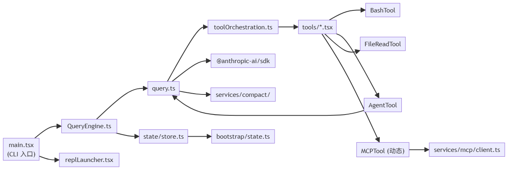
